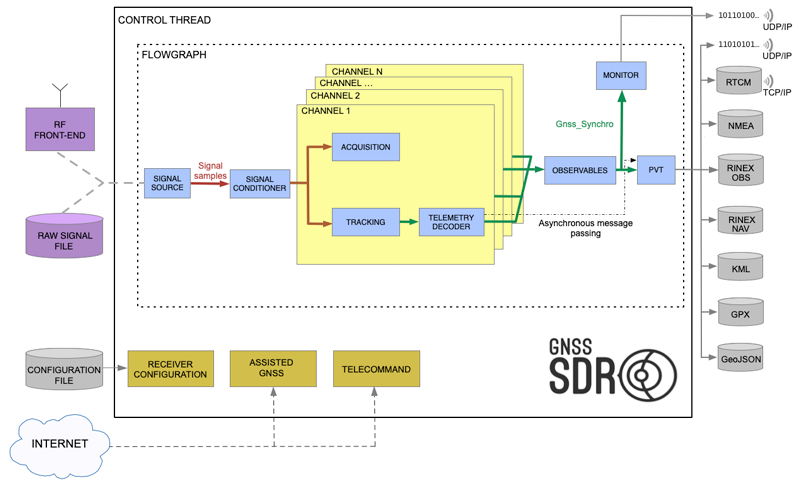
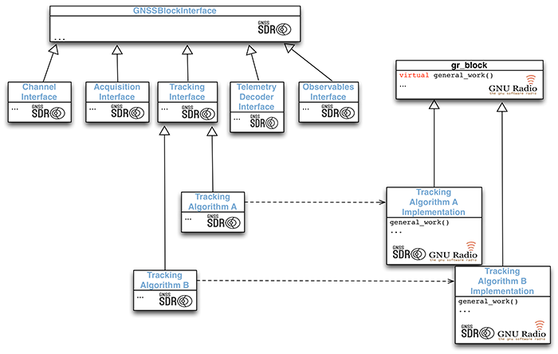
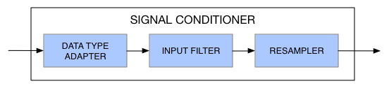

<!-- prettier-ignore-start -->
[comment]: # (
SPDX-License-Identifier: GPL-3.0-or-later
)

[comment]: # (
SPDX-FileCopyrightText: 2011-2024 Carles Fernandez-Prades <carles.fernandez@cttc.es>
)
<!-- prettier-ignore-end -->

[](https://gnss-sdr.org "GNSS-SDR website")

[](https://www.gnu.org/licenses/gpl-3.0)
[](https://api.reuse.software/info/github.com/gnss-sdr/gnss-sdr)
[](CODE_OF_CONDUCT.md)

**Welcome to GNSS-SDR!**

This program is a software-defined receiver which is able to process (that is,
to perform detection, synchronization, demodulation and decoding of the
navigation message, computation of observables, and, finally, computation of
position fixes) the following Global Navigation Satellite System's signals:

In the L1 band:

- &#128752; GLONASS L1 C/A (centered at 1602.000 MHz) :white_check_mark:
- &#128752; GPS L1 C/A (centered at 1575.420 MHz) :white_check_mark:
- &#128752; Galileo E1b/c (centered at 1575.420 MHz) :white_check_mark:
- &#128752; BeiDou B1I (centered at 1561.098 MHz) :white_check_mark:

In the E6 band:

- &#128752; Galileo E6B (centered at 1278.750 MHz) :white_check_mark:

In the L2 band:

- &#128752; BeiDou B3I (centered at 1268.520 MHz) :white_check_mark:
- &#128752; GLONASS L2 C/A (centered at 1246.000 MHz) :white_check_mark:
- &#128752; GPS L2C (centered at 1227.600 MHz) :white_check_mark:

In the L5 band:

- &#128752; Galileo E5b (centered at 1207.140 MHz) :white_check_mark:
- &#128752; Galileo E5a (centered at 1176.450 MHz) :white_check_mark:
- &#128752; GPS L5 (centered at 1176.450 MHz) :white_check_mark:

GNSS-SDR provides interfaces for a wide range of radio frequency front-ends and
raw sample file formats, generates processing outputs in standard formats,
allows for the full inspection of the whole signal processing chain, and offers
a framework for the development of new features. Please visit
[https://gnss-sdr.org](https://gnss-sdr.org "GNSS-SDR website") for more
information about this open-source, software-defined GNSS receiver.

:sparkles: See what's new in the [changelog](./docs/CHANGELOG.md).

# Table of Contents

<details>
<summary><b>(click to expand)</b></summary>
<!-- MarkdownTOC -->

- [Table of Contents](#table-of-contents)
- [How to build GNSS-SDR](#how-to-build-gnss-sdr)
  - [GNU/Linux](#gnulinux)
    - [Alternative 1: Install dependencies using software packages](#alternative-1-install-dependencies-using-software-packages)
      - [Debian / Ubuntu](#debian--ubuntu)
      - [AlmaLinux](#almalinux)
      - [Arch Linux](#arch-linux)
      - [Fedora](#fedora)
      - [openSUSE](#opensuse)
      - [Rocky Linux](#rocky-linux)
    - [Alternative 2: Install dependencies using PyBOMBS](#alternative-2-install-dependencies-using-pybombs)
    - [Manual installation of other required dependencies](#manual-installation-of-other-required-dependencies)
      - [Install Armadillo, a C++ linear algebra library](#install-armadillo-a-c-linear-algebra-library)
      - [Install Gflags, a commandline flags processing module for C++](#install-gflags-a-commandline-flags-processing-module-for-c)
      - [Install Glog, a library that implements application-level logging](#install-glog-a-library-that-implements-application-level-logging)
      - [Install the OpenSSL libraries](#install-the-openssl-libraries)
      - [Install Matio, MATLAB MAT file I/O library](#install-matio-matlab-mat-file-io-library)
      - [Install Protocol Buffers, a portable mechanism for serialization of structured data](#install-protocol-buffers-a-portable-mechanism-for-serialization-of-structured-data)
      - [Install Pugixml, a light-weight C++ XML processing library](#install-pugixml-a-light-weight-c-xml-processing-library)
      - [Download GoogleTest](#download-googletest)
    - [Clone GNSS-SDR's Git repository](#clone-gnss-sdrs-git-repository)
    - [Build and install GNSS-SDR](#build-and-install-gnss-sdr)
      - [Build OSMOSDR support (OPTIONAL)](#build-osmosdr-support-optional)
      - [Build FMCOMMS2 based SDR Hardware support (OPTIONAL)](#build-fmcomms2-based-sdr-hardware-support-optional)
      - [Build OpenCL support (OPTIONAL)](#build-opencl-support-optional)
      - [Build CUDA support (OPTIONAL)](#build-cuda-support-optional)
  - [macOS](#macos)
    - [Macports](#macports)
    - [Homebrew](#homebrew)
    - [Other package managers](#other-package-managers)
    - [Build GNSS-SDR](#build-gnss-sdr)
  - [Other builds](#other-builds)
- [Updating GNSS-SDR](#updating-gnss-sdr)
- [Getting started](#getting-started)
- [Using GNSS-SDR](#using-gnss-sdr)
  - [Control plane](#control-plane)
    - [Configuration](#configuration)
    - [GNSS block factory](#gnss-block-factory)
  - [Signal Processing plane](#signal-processing-plane)
    - [Signal Source](#signal-source)
    - [Signal Conditioner](#signal-conditioner)
      - [Data type adapter](#data-type-adapter)
      - [Input filter](#input-filter)
      - [Resampler](#resampler)
    - [Channel](#channel)
      - [Acquisition](#acquisition)
      - [Tracking](#tracking)
      - [Decoding of the navigation message](#decoding-of-the-navigation-message)
    - [Observables](#observables)
    - [Computation of Position, Velocity, and Time](#computation-of-position-velocity-and-time)
- [About the software license](#about-the-software-license)
- [Publications and Credits](#publications-and-credits)
- [Ok, now what?](#ok-now-what)

<!-- /MarkdownTOC -->
</details>

# How to build GNSS-SDR

This section describes how to set up the compilation environment in GNU/Linux or
[macOS / Mac OS X](#macos), and to build GNSS-SDR. See also our
[build and install page](https://gnss-sdr.org/build-and-install/ "GNSS-SDR's Build and Install").

## GNU/Linux

- Tested distributions: Ubuntu 14.04 LTS and above; Debian 9.0 "stretch" and
  above; Arch Linux; Fedora 26 and above; OpenSUSE 42.3 and above.
- Supported microprocessor architectures:
  - i386: Intel x86 instruction set (32-bit microprocessors).
  - amd64: also known as x86-64, the 64-bit version of the x86 instruction set,
    originally created by AMD and implemented by AMD, Intel, VIA, and others.
  - armel: ARM embedded ABI, supported on ARM v4t and higher.
  - armhf: ARM hard float, ARMv7 + VFP3-D16 floating-point hardware extension +
    Thumb-2 instruction set and above.
  - arm64: ARM 64 bits or ARMv8.
  - mips: MIPS architecture (big-endian, such as those manufactured by SGI).
  - mipsel: MIPS architecture (little-endian, such as Loongson 3).
  - mips64el: 64-bit version of MIPS architecture.
  - powerpc: the RISC 32-bit microprocessor architecture developed by IBM,
    Motorola (now Freescale), and Apple.
  - ppc64: 64-bit big-endian PowerPC architecture.
  - ppc64el: 64-bit little-endian PowerPC architecture.
  - riscv64: 64-bit RISC-V open standard instruction set architecture.
  - s390x: IBM System z architecture for mainframe computers.

Older distribution releases might work as well, but you will need GCC 4.7 or
newer.

Before building GNSS-SDR, you need to install all the required dependencies.
There are two alternatives here: through software packages or building them from
the source code. It is in general not a good idea to mix both approaches.

### Alternative 1: Install dependencies using software packages

If you want to start building and running GNSS-SDR as quickly and easily as
possible, the best option is to install all the required dependencies as binary
packages.

#### Debian / Ubuntu

If you are using Debian 9, Ubuntu 14.10 or above, this can be done by copying
and pasting the following line in a terminal:

```
$ sudo apt-get install build-essential cmake git pkg-config libboost-dev libboost-date-time-dev \
       libboost-system-dev libboost-filesystem-dev libboost-thread-dev libboost-chrono-dev \
       libboost-serialization-dev liblog4cpp5-dev libuhd-dev gnuradio-dev gr-osmosdr \
       libblas-dev liblapack-dev libarmadillo-dev libgflags-dev libgoogle-glog-dev \
       libssl-dev libpcap-dev libmatio-dev libpugixml-dev libgtest-dev \
       libprotobuf-dev libcpu-features-dev protobuf-compiler python3-mako
```

Please note that the required files from `libgtest-dev` were named `googletest`
in Debian 9 "stretch" and Ubuntu 18.04 "bionic", and renamed to `libgtest-dev`
in Debian 10 "buster" and above.

In distributions older than Ubuntu 21.04 Hirsute / Debian 11, the package
`libcpu-features-dev` is not required.

In distributions older than Ubuntu 22.04 Jammy / Debian 12, the package
`libssl-dev` must be replaced by `libgnutls-openssl-dev`.

**Note for Ubuntu 14.04 LTS "trusty" users:** you will need to build from source
and install GNU Radio manually, as explained below, since GNSS-SDR requires
`gnuradio-dev` >= 3.7.3, and Ubuntu 14.04 came with 3.7.2. Install all the
packages above BUT EXCEPT `libuhd-dev`, `gnuradio-dev`, and `gr-osmosdr` (and
remove them if they are already installed in your machine), and install those
dependencies using PyBOMBS. The same applies to `libmatio-dev`: Ubuntu 14.04
came with 1.5.2 and the minimum required version is 1.5.3. Please do not install
the `libmatio-dev` package and install `libtool`, `automake` and `libhdf5-dev`
instead. A recent version of the library will be downloaded and built
automatically if CMake does not find it installed.

In distributions older than Ubuntu 16.04 or Debian 9, `python3-mako` must be
replaced by `python-mako`. For Ubuntu 14.04, you will need to add the package
`python-six` to the list of dependencies.

Once you have installed these packages, you can jump directly to
[download the source code and build GNSS-SDR](#clone-gnss-sdrs-git-repository).

#### AlmaLinux

If you are using AlmaLinux:

```
# dnf update -y
# dnf install -y 'dnf-command(config-manager)'
# dnf config-manager --set-enabled powertools
# dnf install -y epel-release
# dnf install -y make gcc gcc-c++ kernel-devel cmake git boost-devel \
      boost-date-time boost-system boost-thread boost-chrono \
      boost-serialization log4cpp-devel gmp-devel uhd-devel gnuradio-devel \
      pugixml-devel matio-devel protobuf-devel glog-devel libpcap-devel \
      blas-devel lapack-devel armadillo-devel openssl-devel python3-mako \
      libarchive
```

Once you have installed these packages, you can jump directly to
[download the source code and build GNSS-SDR](#clone-gnss-sdrs-git-repository).

#### Arch Linux

If you are using Arch Linux:

```
$ pacman -S gcc make cmake pkgconf git boost boost-libs libvolk gnuradio \
       blas lapack hdf5 openssl pugixml libmatio protobuf libpcap gtest \
       python-mako
```

Once you have installed these packages, you can jump directly to
[download the source code and build GNSS-SDR](#clone-gnss-sdrs-git-repository).

#### Fedora

If you are using Fedora 26 or above, the required software dependencies can be
installed by doing:

```
$ sudo yum install make automake gcc gcc-c++ kernel-devel cmake git boost-devel \
       boost-date-time boost-system boost-filesystem boost-thread boost-chrono \
       boost-serialization log4cpp-devel gnuradio-devel gr-osmosdr-devel \
       blas-devel lapack-devel matio-devel armadillo-devel gflags-devel \
       glog-devel openssl-devel libpcap-devel pugixml-devel python3-mako \
       protobuf-devel protobuf-compiler
```

In Fedora 33 and above, you will need to add `gmp-devel` to the package list.
Optionally, you can add `uhd-devel` starting from Fedora 32.

In Fedora 36 and above, packages `spdlog-devel` and `fmt-devel` are also
required.

#### openSUSE

If you are using openSUSE Leap:

```
$ zypper install cmake git gcc-c++ boost-devel libboost_atomic-devel \
       libboost_system-devel libboost_filesystem-devel libboost_chrono-devel \
       libboost_thread-devel libboost_serialization-devel log4cpp-devel \
       gnuradio-devel pugixml-devel libpcap-devel armadillo-devel libtool \
       automake hdf5-devel openssl-devel python3-Mako libmatio-devel
```

If you are using openSUSE Tumbleweed:

```
$ zypper install cmake git gcc-c++ boost-devel libboost_atomic-devel \
       libboost_system-devel libboost_filesystem-devel libboost_date_time-devel \
       libboost_thread-devel libboost_chrono-devel libboost_serialization-devel \
       spdlog-devel fmt-devel gtest gnuradio-devel pugixml-devel libpcap-devel \
       armadillo-devel libtool automake hdf5-devel libopenssl-devel \
       python3-Mako protobuf-devel
```

Once you have installed these packages, you can jump directly to
[download the source code and build GNSS-SDR](#clone-gnss-sdrs-git-repository).

#### Rocky Linux

If you are using Rocky Linux:

```
$ dnf install -y 'dnf-command(config-manager)'
$ dnf config-manager --set-enabled powertools
$ yum install -y epel-release
$ yum install -y make gcc gcc-c++ kernel-devel cmake git boost-devel \
       boost-date-time boost-system boost-thread boost-chrono boost-serialization \
       log4cpp-devel gmp-devel uhd-devel gnuradio-devel pugixml-devel matio-devel \
       protobuf-devel glog-devel libpcap-devel blas-devel lapack-devel \
       armadillo-devel openssl-devel python3-mako libarchive
```

Once you have installed these packages, you can jump directly to
[download the source code and build GNSS-SDR](#clone-gnss-sdrs-git-repository).

### Alternative 2: Install dependencies using PyBOMBS

This option is adequate if you are interested in development, in working with
the most recent versions of software dependencies, want more fine-tuning on the
installed versions, or simply in building everything from the scratch just for
the fun of it. In such cases, we recommend using
[PyBOMBS](https://github.com/gnuradio/pybombs "Python Build Overlay Managed Bundle System")
(Python Build Overlay Managed Bundle System), GNU Radio's meta-package manager
tool that installs software from source, or whatever the local package manager
is, that automatically does all the work for you. Please take a look at the
configuration options and general PyBOMBS usage at
https://github.com/gnuradio/pybombs. Here we provide a quick step-by-step
tutorial.

First of all, install some basic packages:

```
$ sudo apt-get install git python3-pip
```

Download, build and install PyBOMBS:

```
$ sudo pip3 install --upgrade git+https://github.com/gnuradio/pybombs.git
```

Apply a configuration:

```
$ pybombs auto-config
```

Add list of default recipes:

```
$ pybombs recipes add-defaults
```

Download, build and install GNU Radio, related drivers, and some other extra
modules into the directory `/path/to/prefix` (replace this path by your
preferred one, for instance `$HOME/sdr`):

```
$ pybombs prefix init /path/to/prefix -a myprefix -R gnuradio-default
```

This will perform a local installation of the dependencies under
`/path/to/prefix`, so they will not be visible when opening a new terminal. In
order to make them available, you will need to set up the adequate environment
variables:

```
$ cd /path/to/prefix
$ . ./setup_env.sh
```

Now you are ready to use GNU Radio and to jump into building GNSS-SDR after
installing a few other dependencies. Actually, those are steps that PyBOMBS can
do for you as well:

```
$ pybombs install gnss-sdr
```

By default, PyBOMBS installs the ‘next’ branch of GNSS-SDR development, which is
the most recent version of the source code. This behavior can be modified by
altering the corresponding recipe at
`$HOME/.pybombs/recipes/gr-recipes/gnss-sdr.lwr`

In case you do not want to use PyBOMBS and prefer to build and install GNSS-SDR
step by step (i.e., cloning the repository and doing the usual
`cmake .. && make && make install` dance), Armadillo, GFlags, Glog, GnuTLS, and
Matio can be installed either by using PyBOMBS:

```
$ pybombs install armadillo gflags glog gnutls matio
```

or manually as explained below, and then please follow instructions on how to
[download the source code and build GNSS-SDR](#clone-gnss-sdrs-git-repository).

### Manual installation of other required dependencies

#### Install [Armadillo](https://arma.sourceforge.net/ "Armadillo's Homepage"), a C++ linear algebra library

```
$ sudo apt-get install libblas-dev liblapack-dev       # For Debian/Ubuntu/LinuxMint
$ sudo yum install lapack-devel blas-devel             # For Fedora/RHEL
$ sudo zypper install lapack-devel blas-devel          # For OpenSUSE
$ sudo pacman -S blas lapack                           # For Arch Linux
$ wget https://sourceforge.net/projects/arma/files/armadillo-14.0.0.tar.xz
$ tar xvfz armadillo-14.0.0.tar.xz
$ cd armadillo-14.0.0
$ cmake .
$ make
$ sudo make install
```

The full stop separated from `cmake` by a space is important.
[CMake](https://cmake.org/ "CMake's Homepage") will figure out what other
libraries are currently installed and will modify Armadillo's configuration
correspondingly. CMake will also generate a run-time armadillo library, which is
a combined alias for all the relevant libraries present on your system (e.g.,
BLAS, LAPACK, and ATLAS).

#### Install [Gflags](https://github.com/gflags/gflags "Gflags' Homepage"), a commandline flags processing module for C++

```
$ wget https://github.com/gflags/gflags/archive/v2.2.2.tar.gz
$ tar xvfz v2.2.2.tar.gz
$ cd gflags-2.2.2
$ cmake -DBUILD_SHARED_LIBS=ON -DBUILD_STATIC_LIBS=OFF -DBUILD_gflags_nothreads_LIB=OFF .
$ make
$ sudo make install
$ sudo ldconfig
```

Please note that GFlags is replaced by the
[Abseil Flags Library](https://abseil.io/docs/cpp/guides/flags) if Abseil >=
v20240116 is available in your system.

#### Install [Glog](https://github.com/google/glog "Glog's Homepage"), a library that implements application-level logging

```
$ wget https://github.com/google/glog/archive/v0.7.1.tar.gz
$ tar xvfz v0.7.1.tar.gz
$ cd glog-0.7.1
$ mkdir build && cd build
$ cmake ..
$ make
$ sudo make install
$ sudo ldconfig
```

Please note that Glog is replaced by the
[Abseil Logging Library](https://abseil.io/docs/cpp/guides/logging) if Abseil >=
v20240116 is available in your system.

#### Install the OpenSSL libraries

```
$ sudo apt-get install libssl-dev         # For Debian/Ubuntu/LinuxMint
$ sudo yum install openssl-devel          # For Fedora/CentOS/RHEL
$ sudo zypper install openssl-devel       # For OpenSUSE
$ sudo pacman -S openssl                  # For Arch Linux
```

#### Install [Matio](https://github.com/tbeu/matio "Matio's Homepage"), MATLAB MAT file I/O library

```
$ wget https://github.com/tbeu/matio/releases/download/v1.5.26/matio-1.5.27.tar.gz
$ tar xvfz matio-1.5.27.tar.gz
$ cd matio-1.5.27
$ ./configure
$ make
$ sudo make install
$ sudo ldconfig
```

#### Install [Protocol Buffers](https://protobuf.dev/ "Protocol Buffers' Homepage"), a portable mechanism for serialization of structured data

GNSS-SDR requires Protocol Buffers v3.0.0 or later. If the packages that come
with your distribution are older than that (_e.g._, Ubuntu 16.04 Xenial came
with an older versions), then you will need to install it manually:

```
$ git clone --recursive https://github.com/protocolbuffers/protobuf.git
$ cd protobuf
$ cmake -DABSL_PROPAGATE_CXX_STD=ON -Dprotobuf_BUILD_TESTS=OFF .
$ cmake --build --config Release --target install .
$ sudo ldconfig
```

For more options, please check the
[Protocol Buffers' installation instructions](https://github.com/protocolbuffers/protobuf/blob/main/src/README.md/).

#### Install [Pugixml](https://pugixml.org/ "Pugixml's Homepage"), a light-weight C++ XML processing library

```
$ wget https://github.com/zeux/pugixml/releases/download/v1.14/pugixml-1.14.tar.gz
$ tar xvfz pugixml-1.14.tar.gz
$ cd pugixml-1.14
$ mkdir build && cd build
$ cmake ..
$ make
$ sudo make install
$ sudo ldconfig
```

#### Download [GoogleTest](https://github.com/google/googletest "Googletest Homepage")

```
$ wget https://github.com/google/googletest/archive/refs/tags/v1.15.2.zip
$ unzip v1.15.2.zip
```

Please **DO NOT build or install** Google Test. Every user needs to compile
tests using the same compiler flags used to compile the Google Test libraries;
otherwise, he or she may run into undefined behaviors (_i.e._, the tests can
behave strangely and may even crash for no obvious reasons). The explanation is
that C++ has the One-Definition Rule: if two C++ source files contain different
definitions of the same class/function/variable, and you link them together, you
violate the rule. The linker may or may not catch the error (in many cases it is
not required by the C++ standard to catch the violation). If it does not, you
get strange run-time behaviors that are unexpected and hard to debug. If you
compile Google Test and your test code using different compiler flags, they may
see different definitions of the same class/function/variable (_e.g._, due to
the use of `#if` in Google Test). Therefore, for your sanity, GNSS-SDR does not
make use of pre-compiled Google Test libraries. Instead, it compiles Google
Test's source code itself, such that it can be sure that the same flags are used
for both Google Test and the tests. The building system of GNSS-SDR manages the
compilation and linking of Google Test's source code to its own tests; it is
only required that you tell the system where the Google Test folder that you
downloaded resides. Just type in your terminal (or add it to your
`$HOME/.bashrc` file for a permanent solution) the following line:

```
export GTEST_DIR=/home/username/googletest-1.15.2
```

changing `/home/username/googletest-1.15.2` by the actual path where you
unpacked Google Test. If the CMake script does not find that folder, or the
environment variable is not defined, or the source code is not installed by a
package, then it will download a fresh copy of the Google Test source code and
will compile and link it for you.

<a name="download-and-build-linux"></a>

### Clone GNSS-SDR's Git repository

```
$ git clone https://github.com/gnss-sdr/gnss-sdr
```

Cloning the GNSS-SDR repository as in the line above will create a folder named
gnss-sdr with the following structure:

```
 |-gnss-sdr
 |---build      <- where gnss-sdr is built.
 |---cmake      <- CMake-related files.
 |---conf       <- Configuration files. Each file defines one particular receiver.
 |---data       <- Populate this folder with your captured data.
 |---docs       <- Contains documentation-related files.
 |---install    <- Executables will be placed here.
 |---src        <- Source code folder.
 |-----algorithms  <- Signal processing blocks.
 |-----core     <- Control plane, interfaces, systems' parameters.
 |-----main     <- Main function of the C++ program.
 |-----tests    <- QA code.
 |-----utils    <- some utilities (e.g. Matlab scripts).
```

By default, you will be in the 'main' branch of the Git repository, which
corresponds to the latest stable release. If you want to try the latest
developments, you can use the 'next' branch by going to the newly created
gnss-sdr folder doing:

```
$ git checkout next
```

More information about GNSS-SDR-specific Git usage and pointers to further
readings can be found at our
[Git tutorial](https://gnss-sdr.org/docs/tutorials/using-git/ "Using Git").

### Build and install GNSS-SDR

Go to GNSS-SDR's build directory:

```
$ cd gnss-sdr/build
```

Configure and build the application:

```
$ cmake ..
$ make
```

By default, CMake will build the Release version, meaning that the compiler will
generate a fast, optimized executable. This is the recommended build type when
using an RF front-end and you need to attain real-time. If working with a file
(and thus without real-time constraints), you may want to obtain more
information about the internals of the receiver, as well as more fine-grained
logging. This can be done by building the Debug version, by doing:

```
$ cmake -DCMAKE_BUILD_TYPE=Debug ..
$ make
```

This will create four executables at gnss-sdr/install, namely `gnss-sdr`,
`run_tests`, `front-end-cal` and `volk_gnsssdr_profile`. You can run them from
that folder, but if you prefer to install `gnss-sdr` on your system and have it
available anywhere else, do:

```
$ sudo make install
```

This will also make a copy of the conf/ folder into
/usr/local/share/gnss-sdr/conf for your reference. We suggest creating a working
directory at your preferred location and store your own configuration and data
files there.

You could be interested in creating the documentation (requires:
`sudo apt-get install doxygen-latex` in Ubuntu/Debian) by doing:

```
$ make doc
```

from the gnss-sdr/build folder. This will generate HTML documentation that can
be retrieved pointing your browser of preference to build/docs/html/index.html.
If a LaTeX installation is detected in your system,

```
$ make pdfmanual
```

will create a PDF manual at build/docs/GNSS-SDR_manual.pdf. Finally,

```
$ make doc-clean
```

will remove the content of previously generated documentation.

GNSS-SDR comes with a library which is a module of the Vector-Optimized Library
of Kernels (so-called
[VOLK_GNSSSDR](./src/algorithms/libs/volk_gnsssdr_module/volk_gnsssdr/README.md))
and a profiler that will build a config file for the best SIMD architecture for
your processor. Run `volk_gnsssdr_profile` that is installed into `$PREFIX/bin`.
This program tests all known VOLK kernels for each architecture supported by the
processor. When finished, it will write to
`$HOME/.volk_gnsssdr/volk_gnsssdr_config` the best architecture for the VOLK
function. This file is read when using a function to know the best version of
the function to execute. It mimics GNU Radio's [VOLK](https://www.libvolk.org/)
library, so if you still have not run `volk_profile`, this is a good moment to
do so.

If you are using [Eclipse](https://www.eclipse.org/ide/) as your development
environment, CMake can create the project for you. However, if the build
directory is a subdirectory of the source directory (as is the case of the
`gnss-sdr/build` folder), this is not supported well by Eclipse. It is strongly
recommended to use a build directory which is a sibling of the source directory.
Hence, type from the `gnss-sdr` root folder:

```
$ cd ..
$ mkdir eclipse && cd eclipse
$ cmake -G "Eclipse CDT4 - Unix Makefiles" -DCMAKE_ECLIPSE_GENERATE_SOURCE_PROJECT=TRUE -DCMAKE_ECLIPSE_VERSION=4.5 ../gnss-sdr
```

and then import the created project into Eclipse:

1. Import project using Menu File -> Import.
2. Select General -> Existing projects into workspace.
3. Select your root directory: Browse and select your newly created `eclipse/`
   directory. Keep "Copy projects into workspace" unchecked.
4. Click on "Finish" and you will get a fully functional Eclipse project.

After building the project, you will find the generated binaries at
`eclipse/install`.

#### Build OSMOSDR support (OPTIONAL)

Install the [OsmoSDR](https://osmocom.org/projects/sdr "OsmoSDR's Homepage")
library and GNU Radio's source block:

```
$ git clone git://git.osmocom.org/osmo-sdr.git
$ cd osmo-sdr/software/libosmosdr
$ mkdir build
$ cd build/
$ cmake ..
$ make
$ sudo make install
$ sudo ldconfig
$ cd ../..
$ git clone git://git.osmocom.org/gr-osmosdr
$ cd gr-osmosdr
$ mkdir build
$ cd build
$ cmake .. -Wno-dev
$ make
$ sudo make install
$ sudo ldconfig
```

Then, configure GNSS-SDR to build the `Osmosdr_Signal_Source` by:

```
$ cmake -DENABLE_OSMOSDR=ON ..
$ make
$ sudo make install
```

(in order to disable the `Osmosdr_Signal_Source` compilation, you can pass
`-DENABLE_OSMOSDR=OFF` to cmake and build GNSS-SDR again).

#### Build FMCOMMS2 based SDR Hardware support (OPTIONAL)

Install the [libiio](https://github.com/analogdevicesinc/libiio.git) (>=v0.11),
[libad9361](https://github.com/analogdevicesinc/libad9361-iio.git) (>=v0.1-1)
libraries and [gr-iio](https://github.com/analogdevicesinc/gr-iio.git) (>v0.3)
gnuradio block:

```
$ sudo apt-get install libxml2-dev bison flex
$ git clone https://github.com/analogdevicesinc/libiio.git
$ cd libiio
$ mkdir build
$ cd build
$ cmake ..
$ make && sudo make install && sudo ldconfig
$ cd ../..
$ git clone https://github.com/analogdevicesinc/libad9361-iio.git
$ cd libad9361-iio
$ mkdir build
$ cd build
$ cmake ..
$ make && sudo make install && sudo ldconfig
$ cd ../..
$ git clone https://github.com/analogdevicesinc/gr-iio.git
$ cd gr-iio
$ mkdir build
$ cd build
$ cmake -DCMAKE_INSTALL_PREFIX=/usr ..
$ make && sudo make install && sudo ldconfig
$ cd ../..
```

Then configure GNSS-SDR to build the `Fmcomms2_Signal_Source` implementation:

```
$ cd gnss-sdr/build
$ cmake -DENABLE_FMCOMMS2=ON ..
$ make
$ sudo make install
```

or configure it to build `Plutosdr_Signal_Source`:

```
$ cmake -DENABLE_PLUTOSDR=ON ..
$ make
$ sudo make install
```

With `Fmcomms2_Signal_Source` you can use any SDR hardware based on
[FMCOMMS2](https://wiki.analog.com/resources/eval/user-guides/ad-fmcomms2-ebz),
including the ADALM-PLUTO (PlutoSdr) by configuring correctly the .conf file.
The `Plutosdr_Signal_Source` offers a simpler manner to use the ADALM-PLUTO
because implements only a subset of FMCOMMS2's parameters valid for those
devices.

#### Build OpenCL support (OPTIONAL)

In order to enable the building of blocks that use OpenCL, type:

```
$ cmake -DENABLE_OPENCL=ON ..
$ make
$ sudo make install
```

#### Build CUDA support (OPTIONAL)

In order to enable the building of blocks that use CUDA, NVIDIA's parallel
programming model that enables graphics processing unit (GPU) acceleration for
data-parallel computations, first you need to install the CUDA Toolkit from
[NVIDIA Developers Download page](https://developer.nvidia.com/cuda-downloads "CUDA Downloads").
Make sure that the SDK samples build well. Then, build GNSS-SDR by doing:

```
$ cmake -DENABLE_CUDA=ON ..
$ make
$ sudo make install
```

Of course, you will also need a GPU that
[supports CUDA](https://developer.nvidia.com/cuda-gpus "CUDA GPUs").

## macOS

GNSS-SDR can be built on macOS (or the former Mac OS X), starting from 10.9
(Mavericks) and including 14 (Sonoma). If you still have not installed
[Xcode](https://developer.apple.com/xcode/ "Xcode"), do it now from the App
Store (it's free). You will also need the Xcode Command Line Tools, which do not
come by default in macOS versions older than Big Sur. If you are using an older
version, please launch the Terminal, found in /Applications/Utilities/, and
type:

```
$ xcode-select --install
```

Agree to Xcode license:

```
$ sudo xcodebuild -license
```

Software pre-requisites can be installed using either [Macports](#macports) or
[Homebrew](#homebrew).

### Macports

First, [install Macports](https://www.macports.org/install.php). If you are
upgrading from a previous installation, please follow the
[migration rules](https://trac.macports.org/wiki/Migration).

In a terminal, type:

```
$ sudo port selfupdate
$ sudo port upgrade outdated
$ sudo port install armadillo cmake pkgconfig protobuf3-cpp pugixml openssl3
$ sudo port install gnuradio +uhd +grc +zeromq
$ sudo port install boost matio libad9361-iio libiio
$ sudo port install py311-mako
$ sudo port install doxygen +docs
```

For macOS versions older than Sonoma, you will also need LAPACK:

```
$ sudo port install lapack
```

You also might need to activate a Python installation. The list of installed
versions can be retrieved with:

```
$ port select --list python
```

and you can activate a certain version by typing:

```
$ sudo port select --set python python311
```

### Homebrew

First, install [Homebrew](https://brew.sh/). Paste this in a terminal prompt:

```
$ /usr/bin/ruby -e "$(curl -fsSL https://raw.githubusercontent.com/Homebrew/install/master/install)"
```

The script explains what it will do, and then it pauses before doing it. There
are more installation options [here](https://docs.brew.sh/Installation.html).

Install the required dependencies:

```
$ brew update && brew upgrade
$ brew install armadillo cmake hdf5 gnuradio libmatio openssl pkg-config protobuf pugixml
$ brew install --cask mactex  # when completed, restart Terminal
$ brew install graphviz doxygen
¢ pip3 install mako
```

For macOS versions older than Sonoma, you will also need LAPACK:

```
$ brew install lapack
```

### Other package managers

GNU Radio and other dependencies can also be installed using other package
managers than Macports, such as [Fink](https://www.finkproject.org/ "Fink").
Since the version of Python that ships with OS X is great for learning but it is
not good for development, you could have another Python executable in a
non-standard location. If that is the case, you need to inform GNSS-SDR's
configuration system by defining the `PYTHON_EXECUTABLE` variable as:

```
$ cmake -DPYTHON_EXECUTABLE=/path/to/bin/python3 ..
```

In case you have installed Macports in a non-standard location, you can use:

```
$ cmake -DCMAKE_PREFIX_PATH=/opt/local -DUSE_MACPORTS_PYTHON=/opt/local/bin/python ..
```

changing `/opt/local` by the base directory in which your software is installed.

The CMake script will create Makefiles that download, build and link Armadillo,
Gflags, Glog, Matio, Protocol Buffers, PugiXML and Google Test on the fly at
compile time if they are not detected in your machine.

### Build GNSS-SDR

Finally, you are ready to clone the GNSS-SDR repository, configure and build the
software:

```
$ git clone https://github.com/gnss-sdr/gnss-sdr
$ cd gnss-sdr/build
$ cmake ..
$ make
```

This will create three executables at gnss-sdr/install, namely `gnss-sdr`,
`run_tests` and `volk_gnsssdr_profile`. You can install the software receiver on
your system by doing:

```
$ sudo make install
```

Note, it is advisable not to run the install step in a homebrew environment.

The documentation can be built by:

```
$ make doc
```

and can be viewed doing:

```
$ open ./docs/html/index.html
```

GNSS-SDR comes with a library which is a module of the Vector-Optimized Library
of Kernels (so-called
[VOLK_GNSSSDR](./src/algorithms/libs/volk_gnsssdr_module/volk_gnsssdr/README.md))
and a profiler that will build a config file for the best SIMD architecture for
your processor. Run `volk_gnsssdr_profile` that is installed into `$PREFIX/bin`.
This program tests all known VOLK kernels for each architecture supported by the
processor. When finished, it will write to
`$HOME/.volk_gnsssdr/volk_gnsssdr_config` the best architecture for the VOLK
function. This file is read when using a function to know the best version of
the function to execute. It mimics GNU Radio's [VOLK](https://www.libvolk.org/)
library, so if you still have not run `volk_profile`, this is a good moment to
do so.

## Other builds

- **Docker image**: A technology providing operating-system-level virtualization
  to build, ship, and run distributed applications, whether on laptops, data
  center VMs, or the cloud. Visit
  [https://github.com/carlesfernandez/docker-gnsssdr](https://github.com/carlesfernandez/docker-gnsssdr)
  or
  [https://github.com/carlesfernandez/docker-pybombs-gnsssdr](https://github.com/carlesfernandez/docker-pybombs-gnsssdr)
  for instructions.

- **Snap package**: [Snaps](https://snapcraft.io) are Linux packages aimed for
  Ubuntu or Ubuntu-like distros. Visit
  [https://github.com/carlesfernandez/snapcraft-sandbox](https://github.com/carlesfernandez/snapcraft-sandbox)
  for instructions, or directly
  [get the software from the Snap Store](https://snapcraft.io/gnss-sdr-next):

<p align="center">
  <a href="https://snapcraft.io/gnss-sdr-next"></a>
</p>

- **GNSS-SDR in embedded platforms**: we provide a Software Development Kit
  (SDK) based on [OpenEmbedded](https://www.openembedded.org/wiki/Main_Page) for
  cross-compiling GNSS-SDR in your desktop computer and for producing
  executables that can run in embedded platforms, such as Xilinx's Zynq and
  ZynqMP architectures, Raspberry Pi, and many others. Please check
  [yocto-geniux](https://github.com/carlesfernandez/yocto-geniux) for
  instructions on how to build bootable images.

# Updating GNSS-SDR

If you cloned or forked GNSS-SDR some time ago, it is possible that some
developer has updated files at the Git repository. If you still have not done
so, add the `upstream` repository to the list of remotes:

```
$ git remote add upstream https://github.com/gnss-sdr/gnss-sdr.git
```

and then you can update your working copy by doing:

```
$ git checkout main        # Switch to branch you want to update
$ git pull upstream main   # Download the newest code from our repository
```

or, if you want to test the latest developments:

```
$ git checkout next
$ git pull upstream next
```

Before rebuilding the source code, it is safe (and recommended) to remove the
remainders of old compilations:

```
$ rm -rf gnss-sdr/build/*
```

If you are interested in contributing to the development of GNSS-SDR, please
check out
[how to do it](https://gnss-sdr.org/contribute/ "How to contribute to GNSS-SDR source code").

There is a more controlled way to upgrade your repository, which is to use the
Git commands `fetch` and `merge`, as described in our
[Git Tutorial](https://gnss-sdr.org/docs/tutorials/using-git/ "Using Git").

# Getting started

1. After building the code, you will find the `gnss-sdr` executable file at
   gnss-sdr/install. You can make it available everywhere else by
   `sudo make install`. Run the profilers `volk_profile` and
   `volk_gnsssdr_profile` for testing all available VOLK kernels for each
   architecture supported by your processor. This only has to be done once.
2. In post-processing mode, you have to provide a captured GNSS signal file. 1.
   The signal file can be easily recorded using the GNU Radio file sink in
   `gr_complex<float>` mode. 2. You will need a GPS active antenna, a
   [USRP](https://www.ettus.com/products/) and a suitable USRP daughter board to
   receive GPS L1 C/A signals. GNSS-SDR requires to have at least 2 MHz of
   bandwidth in 1.57542 GHz. (remember to enable the DC bias with the
   daughterboard jumper). We use a
   [DBSRX2](https://www.ettus.com/all-products/DBSRX2/) to do the task, but you
   can try the newer Ettus' daughter boards as well. 3. The easiest way to
   capture a signal file is to use the GNU Radio Companion GUI. Only two blocks
   are needed: a USRP signal source connected to a complex float file sink. You
   need to tune the USRP central frequency and decimation factor using the USRP
   signal source properties box. We suggest using a decimation factor of 20 if
   you use the USRP2. This will give you 100/20 = 5 MSPS which will be enough to
   receive GPS L1 C/A signals. The front-end gain should also be configured. In
   our test with the DBSRX2 we obtained good results with `G=50`. 4. Capture at
   least 80 seconds of signal in open sky conditions. During the process, be
   aware of USRP driver buffer underruns messages. If your hard disk is not fast
   enough to write data at this speed you can capture it to a virtual RAM drive.
   80 seconds of signal at 5 MSPS occupies less than 3 Gbytes using
   `gr_complex<float>`. If you have no access to an RF front-end, you can
   download a sample raw data file (that contains GPS and Galileo signals) from
   [here](https://sourceforge.net/projects/gnss-sdr/files/data/).
3. You are ready to configure the receiver to use your captured file among other
   parameters:
   1. The default configuration file resides at
      [/usr/local/share/gnss-sdr/conf/default.conf](./conf/gnss-sdr.conf).
   2. You need to review/modify at least the following settings:
      - `SignalSource.filename=` (absolute or relative route to your GNSS signal
        captured file)
      - `GNSS-SDR.internal_fs_sps=` (captured file sampling rate in samples per
        second)
      - `SignalSource.sampling_frequency=` (captured file sampling rate in
        samples per second)
      - `SignalConditioner.sample_freq_in=` (captured file sampling rate in
        samples per second)
      - `SignalConditioner.sample_freq_out=` (captured file sampling rate in
        samples per second)
   3. The configuration file has in-line documentation, you can try to tune the
      number of channels and several receiver parameters. Store your .conf file
      in some working directory of your choice.
4. Run the receiver invoking the configuration by
   `$ gnss-sdr --config_file=/path/to/my_receiver.conf` The program reports the
   current status in text mode, directly to the terminal window. If all goes
   well, and GNSS-SDR is able to successfully track and decode at least 4
   satellites, you will get PVT fixes. The program will write .kml, .geojson and
   RINEX files in the folder from which `gnss-sdr` was run. In addition to the
   console output, GNSS-SDR also writes log files at /tmp/ (configurable with
   the commandline flag `./gnss-sdr --log_dir=/path/to/log`).

For more information, check out our
[quick start guide](https://gnss-sdr.org/quick-start-guide/).

# Using GNSS-SDR

With GNSS-SDR, you can define your own receiver, work with captured raw data or
from an RF front-end, dump into files intermediate signals, or tune every single
algorithm used in the signal processing. All the configuration is done in a
single file. Those configuration files reside at the [gnss-sdr/conf/](./conf/)
folder (or at /usr/local/share/gnss-sdr/conf if you installed the program). By
default, the executable `gnss-sdr` will read the configuration available at
`gnss-sdr/conf/gnss-sdr.conf` (or at (usr/local/share/gnss-sdr/conf/default.conf
if you installed the program). You can edit that file to fit your needs, or even
better, define a new `my_receiver.conf` file with your own configuration. This
new receiver can be generated by invoking gnss-sdr with the `--config_file` flag
pointing to your configuration file:

```
$ gnss-sdr --config_file=/path/to/my_receiver.conf
```

You can use a single configuration file for processing different data files,
specifying the file to be processed with the `--signal_source` flag:

```
$ gnss-sdr --config_file=../conf/my_receiver.conf --signal_source=../data/my_captured_data.dat
```

This will override the `SignalSource.filename` specified in the configuration
file.

## Control plane



GNSS-SDR's main method initializes the logging library, processes the command
line flags, if any, provided by the user and instantiates a
[ControlThread](./src/core/receiver/control_thread.h) object. Its constructor
reads the configuration file, creates a control queue, and creates a flowgraph
according to the configuration. Then, the program's main method calls the run()
method of the instantiated object, an action that connects the flowgraph and
starts running it. After that, and until a stop message is received, it reads
control messages sent by the receiver's modules through a safe-thread queue and
processes them. Finally, when a stop message is received, the main method
executes the destructor of the ControlThread object, which deallocates memory,
does other cleanup, and exits the program.

The [GNSSFlowgraph](./src/core/receiver/gnss_flowgraph.h) class is responsible
for preparing the graph of blocks according to the configuration, running it,
modifying it during run-time, and stopping it. Blocks are identified by their
role. This class knows which roles it has to instantiate and how to connect
them. It relies on the configuration to get the correct instances of the roles
it needs and then it applies the connections between GNU Radio blocks to make
the graph ready to be started. The complexity related to managing the blocks and
the data stream is handled by GNU Radio's `gr::top_block` class. GNSSFlowgraph
wraps the `gr::top_block` instance so we can take advantage of the
`gnss_block_factory` (see below), the configuration system, and the processing
blocks. This class is also responsible for applying changes to the configuration
of the flowgraph during run-time, dynamically reconfiguring channels: it selects
the strategy for selecting satellites. This can range from a sequential search
over all the satellites' ID to other more efficient approaches.

The Control Plane is in charge of creating a flowgraph according to the
configuration and then managing the modules. Configuration allows users to
define in an easy way their own custom receiver by specifying the flowgraph
(type of signal source, number of channels, algorithms to be used for each
channel and each module, strategies for satellite selection, type of output
format, etc.). Since it is difficult to foresee what future module
implementations will be needed in terms of configuration, we used a very simple
approach that can be extended without a major impact on the code. This can be
achieved by simply mapping the names of the variables in the modules with the
names of the parameters in the configuration.

### Configuration

Properties are passed around within the program using the
[ConfigurationInterface](./src/core/interfaces/configuration_interface.h) class.
There are two implementations of this interface:
[FileConfiguration](./src/core/receiver/file_configuration.h) and
[InMemoryConfiguration](./src/core/receiver/in_memory_configuration.h).
FileConfiguration reads the properties (pairs of property name and value) from a
file and stores them internally. InMemoryConfiguration does not read from a
file; it remains empty after instantiation and property values and names are set
using the set property method. FileConfiguration is intended to be used in the
actual GNSS-SDR application whereas InMemoryConfiguration is intended to be used
in tests to avoid file-dependency in the file system. Classes that need to read
configuration parameters will receive instances of ConfigurationInterface from
where they will fetch the values. For instance, parameters related to
SignalSource should look like this:

```
SignalSource.parameter1=value1
SignalSource.parameter2=value2
```

The name of these parameters can be anything but one reserved word:
implementation. This parameter indicates in its value the name of the class that
has to be instantiated by the factory for that role. For instance, if our signal
source is providing data already at baseband and thus we want to use the
implementation [Pass_Through](./src/algorithms/libs/pass_through.h) for module
SignalConditioner, the corresponding line in the configuration file would be

```
SignalConditioner.implementation=Pass_Through
```

Since the configuration is just a set of property names and values without any
meaning or syntax, the system is very versatile and easily extendable. Adding
new properties to the system only implies modifications in the classes that will
make use of these properties. In addition, the configuration files are not
checked against any strict syntax so it is always in a correct status (as long
as it contains pairs of property names and values in the
[INI format](https://en.wikipedia.org/wiki/INI_file)).

### GNSS block factory

Hence, the application defines a simple accessor class to fetch the
configuration pairs of values and passes them to a factory class called
[GNSSBlockFactory](./src/core/receiver/gnss_block_factory.h). This factory
decides, according to the configuration, which class needs to be instantiated
and which parameters should be passed to the constructor. Hence, the factory
encapsulates the complexity of blocks' instantiation. With that approach, adding
a new block that requires new parameters will be as simple as adding the block
class and modifying the factory to be able to instantiate it. This loose
coupling between the blocks' implementations and the syntax of the configuration
enables extending the application capacities to a high degree. It also allows
producing fully customized receivers, for instance a testbed for acquisition
algorithms, and to place observers at any point of the receiver chain.

More information can be found at the
[Control Plane page](https://gnss-sdr.org/docs/control-plane/).

## Signal Processing plane

GNU Radio's class `gr::basic_block` is the abstract base class for all signal
processing blocks, a bare abstraction of an entity that has a name and a set of
inputs and outputs. It is never instantiated directly; rather, this is the
abstract parent class of both `gr::hier_block2`, which is a recursive container
that adds or removes processing or hierarchical blocks to the internal graph,
and `gr::block`, which is the abstract base class for all the processing blocks.



A signal processing flow is constructed by creating a tree of hierarchical
blocks, which at any level may also contain terminal nodes that actually
implement signal processing functions.

Class `gr::top_block` is the top-level hierarchical block representing a
flowgraph. It defines GNU Radio runtime functions used during the execution of
the program: run(), start(), stop(), wait(), etc. A subclass called
[GNSSBlockInterface](./src/core/interfaces/gnss_block_interface.h) is the common
interface for all the GNSS-SDR modules. It defines pure virtual methods, that
are required to be implemented by a derived class.

Subclassing GNSSBlockInterface, we defined interfaces for the GNSS receiver
blocks depicted in the figure above. This hierarchy provides the definition of
different algorithms and different implementations, which will be instantiated
according to the configuration. This strategy allows multiple implementations to
share a common interface, achieving the objective of decoupling interfaces from
implementations: it defines a family of algorithms, encapsulates each one, and
makes them interchangeable. Hence, we let the algorithm vary independently of
the program that uses it.

Internally, GNSS-SDR makes use of the complex data types defined by
[VOLK](https://www.libvolk.org/ "Vector-Optimized Library of Kernels home").
They are fundamental for handling sample streams in which samples are complex
numbers with real and imaginary components of 8, 16, or 32 bits, common formats
delivered by GNSS (and generic SDR) radio frequency front-ends. The following
list shows the data type names that GNSS-SDR exposes through the configuration
file:

- **`byte`**: Signed integer, 8-bit two's complement number ranging from -128
  to 127. C++ type name: `int8_t`.
- **`short`**: Signed integer, 16-bit two's complement number ranging from
  -32768 to 32767. C++ type name: `int16_t` .
- **`float`**: Defines numbers with fractional parts, can represent values
  ranging from approx. 1.5e-45 to 3.4e+38 with a precision of 7 digits (32
  bits). C++ type name: `float`.
- **`ibyte`**: Interleaved (I&Q) stream of samples of type `byte`. C++ type
  name: `int8_t`.
- **`ishort`**: Interleaved (I&Q) stream of samples of type `short`. C++ type
  name: `int16_t`.
- **`cbyte`**: Complex samples, with real and imaginary parts of type `byte`.
  C++ type name: `lv_8sc_t`.
- **`cshort`**: Complex samples, with real and imaginary parts of type `short`.
  C++ type name: `lv_16sc_t`.
- **`gr_complex`**: Complex samples, with real and imaginary parts of type
  `float`. C++ type name: `std::complex<float>`.

More information about the available processing blocks and their configuration
parameters can be found at the
[Signal Processing Blocks documentation page](https://gnss-sdr.org/docs/sp-blocks/).

### Signal Source

The inputs of a software receiver are the raw bits that come out from the
front-end's analog-to-digital converter (ADC). Those bits can be read from a
file stored in the hard disk or directly in real-time from a hardware device
through USB or Ethernet buses.

The Signal Source module is in charge of implementing the hardware driver, that
is, the portion of the code that communicates with the RF front-end and receives
the samples coming from the ADC. This communication is usually performed through
USB or Ethernet buses. Since real-time processing requires a highly optimized
implementation of the whole receiver, this module also allows reading samples
from a file stored in a hard disk, and thus processing without time constraints.
Relevant parameters of those samples are the intermediate frequency (or baseband
I&Q components), the sampling rate, and the number of bits per sample, which
must be specified by the user in the configuration file.

This module also performs bit-depth adaptation, since most of the existing RF
front-ends provide samples quantized with 2 or 3 bits, while operations inside
the processor are performed on 32- or 64-bit words, depending on its
architecture. Although there are implementations of the most intensive
computational processes (mainly correlation) that take advantage of specific
data types and architectures for the sake of efficiency, the approach is
processor-specific and hardly portable. We suggest keeping signal samples in
standard data types and letting the compiler select the best library version
(implemented using SIMD or any other processor-specific technology) of the
required routines for a given processor.

**_Example: File Signal Source_**

The user can configure the receiver for reading from a file, setting in the
configuration file the data file location, sample format, and the sampling
frequency and intermediate frequency at what the signal was originally captured.

```
;######### SIGNAL_SOURCE CONFIG ############
SignalSource.implementation=File_Signal_Source
SignalSource.filename=/home/user/gnss-sdr/data/my_capture.dat
SignalSource.item_type=gr_complex
SignalSource.sampling_frequency=4000000 ; Sampling frequency in samples per second (Sps)
```

Type `gr_complex` refers to a GNU Radio typedef equivalent to
`std::complex<float>`. In order to save some storage space, you might want to
store your signal in a more efficient format such as an I/Q interleaved `short`
integer sample stream. In that case, change the corresponding line to:

```
SignalSource.item_type=ishort
```

In this latter case, you will need to convert the interleaved I/Q samples to a
complex stream via Data Type Adapter block (see below).

**_Example: Two-bit packed file source_**

Sometimes, samples are stored in files with a format that is not in the list of
_native_ types supported by the `File_Signal_Source` implementation (i.e, it is
not among `byte`, `ibyte`, `short`, `ishort`, `float`, or `gr_complex`). This is
the case of 2-bit samples, which is a common format delivered by GNSS RF
front-ends. The `Two_Bit_Packed_File_Signal_Source` implementation allows
reading two-bit length samples from a file. The data is assumed to be packed as
bytes `item_type=byte` or shorts `item_type=short` so that there are 4 two-bit
samples in each byte. The two-bit values are assumed to have the following
interpretation:

| **b_1** | **b_0** | **Value** |
| :-----: | :-----: | :-------: |
|    0    |    0    |    +1     |
|    0    |    1    |    +3     |
|    1    |    0    |    -3     |
|    1    |    1    |    -1     |

Within a byte the samples may be packed in big-endian `big_endian_bytes=true`
(if the most significant byte value is stored at the memory location with the
lowest address, the next byte value in significance is stored at the following
memory location, and so on) or little-endian `big_endian_bytes=false` (if the
least significant byte value is at the lowest address, and the other bytes
follow in increasing order of significance). If the order is big-endian then the
most significant two bits will form the first sample output. Otherwise, the
least significant two bits will be used.

Additionally, the samples may be either real `sample_type=real`, or complex. If
the sample type is complex, then the samples are either stored in the order:
real, imag, real, imag, ... `sample_type=iq` or in the order: imag, real, imag,
real, ... `sample_type=qi`.

Finally, if the data is stored as shorts `item_type=short`, then it may be
stored in either big-endian `big_endian_items=true` or little-endian
`big_endian_items=false`. If the shorts are big-endian then the 2nd byte in each
short is output first.

The output data type is either `float` or `gr_complex` depending on whether or
not `sample_type` is real. Example:

```
;######### SIGNAL_SOURCE CONFIG ############
SignalSource.implementation=Two_Bit_Packed_File_Signal_Source
SignalSource.filename=/data/my_capture.datz
SignalSource.item_type=short
SignalSource.sampling_frequency=60000000
SignalSource.freq=1575468750
SignalSource.samples=6000000000  ; Notice that 0 indicates the entire file.
SignalSource.repeat=false
SignalSource.dump=false
SignalSource.dump_filename=./signal_source.dat
SignalSource.enable_throttle_control=false
SignalSource.sample_type=iq
SignalSource.big_endian_items=true
SignalSource.big_endian_bytes=false
```

**_Example: UHD Signal Source_**

The user may prefer to use a [UHD](https://files.ettus.com/manual/)-compatible
RF front-end and try real-time processing. For instance, for a USRP1 + DBSRX
daughterboard, use:

```
;######### SIGNAL_SOURCE CONFIG ############
SignalSource.implementation=UHD_Signal_Source
SignalSource.item_type=gr_complex
SignalSource.sampling_frequency=4000000 ; Sampling frequency in [Hz]
SignalSource.freq=1575420000 ; RF front-end center frequency in [Hz]
SignalSource.gain=60 ; Front-end gain in dB
SignalSource.subdevice=B:0 ; UHD subdevice specification (for USRP1 use A:0 or B:0, for USRP B210 use A:0)
```

**_Example: Configuring the USRP X300/X310 with two front-ends for receiving
signals in L1 and L2 bands_**

```
;######### SIGNAL_SOURCE CONFIG ############
SignalSource.implementation=UHD_Signal_Source
SignalSource.device_address=192.168.40.2 ; Put your USRP IP address here
SignalSource.item_type=gr_complex
SignalSource.RF_channels=2
SignalSource.sampling_frequency=4000000
SignalSource.subdevice=A:0 B:0

;######### RF Channels specific settings ######
SignalSource.freq0=1575420000
SignalSource.gain0=50
SignalSource.samples0=0
SignalSource.dump0=false

SignalSource.freq1=1227600000
SignalSource.gain1=50
SignalSource.samples1=0
SignalSource.dump1=false
```

**_Example: OsmoSDR-compatible Signal Source_**

[OsmoSDR](https://osmocom.org/projects/sdr) is a small form-factor, inexpensive
software defined radio project. It provides a driver for several front-ends,
such as [RTL-based dongles](https://www.rtl-sdr.com/tag/v3/),
[HackRF](https://greatscottgadgets.com/hackrf/),
[bladeRF](https://www.nuand.com/),
[LimeSDR](https://myriadrf.org/projects/limesdr/),
[etc](https://github.com/osmocom/gr-osmosdr/blob/master/README). Note that not
all the OsmoSDR-compatible devices can work as radio frequency front-ends for
proper GNSS signal reception, please check the specifications. For suitable RF
front-ends, you can use:

```
;######### SIGNAL_SOURCE CONFIG ############
SignalSource.implementation=Osmosdr_Signal_Source
SignalSource.item_type=gr_complex
SignalSource.sampling_frequency=2000000
SignalSource.freq=1575420000
SignalSource.rf_gain=40
SignalSource.if_gain=30
SignalSource.enable_throttle_control=false
SignalSource.osmosdr_args=hackrf,bias=1
```

For [RTL-SDR Blog V3](https://www.rtl-sdr.com/tag/v3/) dongles, the arguments
are:

```
SignalSource.osmosdr_args=rtl,bias=1
```

and for [LimeSDR](https://myriadrf.org/projects/limesdr/):

```
SignalSource.osmosdr_args=driver=lime,soapy=0
```

In case of using a Zarlink's RTL2832 based DVB-T receiver, you can even use the
`rtl_tcp` I/Q server in order to use the USB dongle remotely. In a terminal,
type:

```
$ rtl_tcp -a 127.0.0.1 -p 1234 -f 1575420000 -g 0 -s 2000000
```

and use the following configuration:

```
;######### SIGNAL_SOURCE CONFIG ############
SignalSource.implementation=RtlTcp_Signal_Source
SignalSource.item_type=gr_complex
SignalSource.sampling_frequency=1200000
SignalSource.freq=1575420000
SignalSource.gain=40
SignalSource.rf_gain=40
SignalSource.if_gain=30
SignalSource.AGC_enabled=false
SignalSource.samples=0
SignalSource.enable_throttle_control=false
SignalSource.address=127.0.0.1
SignalSource.port=1234
SignalSource.swap_iq=false
SignalSource.repeat=false
SignalSource.dump=false
SignalSource.dump_filename=../data/signal_source.dat
```

Example for a dual-frequency receiver:

```
;######### SIGNAL_SOURCE CONFIG ############
SignalSource.implementation=UHD_Signal_Source
SignalSource.device_address=192.168.40.2 ; Put your USRP IP address here
SignalSource.item_type=gr_complex
SignalSource.RF_channels=2
SignalSource.sampling_frequency=4000000
SignalSource.subdevice=A:0 B:0

;######### RF Channels specific settings ######
SignalSource.freq0=1575420000
SignalSource.gain0=50
SignalSource.samples0=0
SignalSource.dump0=false

SignalSource.freq1=1227600000
SignalSource.gain1=50
SignalSource.samples1=0
SignalSource.dump1=false
```

More documentation and examples are available at the
[Signal Source Blocks page](https://gnss-sdr.org/docs/sp-blocks/signal-source/).

### Signal Conditioner



The signal conditioner is in charge of resampling the signal and delivering a
reference sample rate to the downstream processing blocks, acting as a facade
between the signal source and the synchronization channels, providing a
simplified interface to the input signal. In the case of multiband front-ends,
this module would be in charge of providing a separated data stream for each
band.

If your signal source is providing baseband signal samples of type `gr_complex`
at 4 Msps, you can bypass the Signal Conditioner block by:

```
SignalConditioner.implementation=Pass_Through
```

If you need to adapt some aspect of your signal, you can enable the Signal
Conditioner and configure three internal blocks: a data type adapter, an input
signal, and a resampler.

```
;#[Signal_Conditioner] enables this block. Then you have to configure [DataTypeAdapter], [InputFilter] and [Resampler] blocks
SignalConditioner.implementation=Signal_Conditioner
```

More documentation at the
[Signal Conditioner Blocks page](https://gnss-sdr.org/docs/sp-blocks/signal-conditioner/).

#### Data type adapter

This block changes the type of input data samples. If your signal source
delivers data samples of type `short`, you can use this block to convert them to
`gr_complex` like this:

```
;######### DATA_TYPE_ADAPTER CONFIG ############
;#implementation: [Pass_Through] disables this block
DataTypeAdapter.implementation=Ishort_To_Complex
```

More documentation at the
[Data Type Adapter Blocks page](https://gnss-sdr.org/docs/sp-blocks/data-type-adapter/).

#### Input filter

This block filters the input data. It can be combined with frequency translation
for IF signals. The computation of the filter taps is based on parameters of GNU
Radio's function
[pm_remez](https://www.gnuradio.org/doc/doxygen/pm__remez_8h.html), which
calculates the optimal (in the Chebyshev/minimax sense) FIR filter impulse
response given a set of band edges, the desired response on those bands, and the
weight given to the error in those bands.

The block can be configured like this:

```
;######### INPUT_FILTER CONFIG ############
;#implementation: Use [Pass_Through] or [Fir_Filter] or [Freq_Xlating_Fir_Filter]
;#[Pass_Through] disables this block
;#[Fir_Filter] enables a FIR Filter
;#[Freq_Xlating_Fir_Filter] enables FIR filter and a composite frequency translation that shifts IF down to zero Hz.
InputFilter.implementation=Freq_Xlating_Fir_Filter
InputFilter.dump=false ; #dump: Dump the filtered data to a file.
InputFilter.dump_filename=../data/input_filter.dat ; #dump_filename: Log path and filename.
InputFilter.input_item_type=gr_complex
InputFilter.output_item_type=gr_complex
InputFilter.taps_item_type=float
InputFilter.number_of_taps=5 ; #number_of_taps: Number of taps in the filter. Increasing this parameter increases the processing time
InputFilter.number_of_bands=2 ; #number_of_bands: Number of frequency bands in the filter.
; Frequency is in the range [0, 1], with 1 being the Nyquist frequency (Fs/2)
; The number of band_begin and band_end elements must match the number of bands
InputFilter.band1_begin=0.0
InputFilter.band1_end=0.85
InputFilter.band2_begin=0.90
InputFilter.band2_end=1.0

;#ampl: desired amplitude at the band edges.
;#The number of ampl_begin and ampl_end elements must match the number of bands
InputFilter.ampl1_begin=1.0
InputFilter.ampl1_end=1.0
InputFilter.ampl2_begin=0.0
InputFilter.ampl2_end=0.0

;#band_error: weighting applied to each band (usually 1).
;#The number of band_error elements must match the number of bands
InputFilter.band1_error=1.0
InputFilter.band2_error=1.0

;#filter_type: one of "bandpass", "hilbert" or "differentiator"
InputFilter.filter_type=bandpass

;#grid_density: determines how accurately the filter will be constructed.
;The minimum value is 16; higher values are slower to compute the filter.
InputFilter.grid_density=16

;#The following options are used only in Freq_Xlating_Fir_Filter implementation.
;#InputFilter.IF is the intermediate frequency (in Hz) shifted down to zero Hz
InputFilter.sampling_frequency=4000000
InputFilter.IF=0
InputFilter.decimation_factor=1
```

More documentation at the
[Input Filter Blocks page](https://gnss-sdr.org/docs/sp-blocks/input-filter/).

#### Resampler

This block resamples the input data stream. The `Direct_Resampler` block
implements a nearest neighbourhood interpolation:

```
;######### RESAMPLER CONFIG ############
;#implementation: Use [Pass_Through] or [Direct_Resampler]
;#[Pass_Through] disables this block
Resampler.implementation=Direct_Resampler
Resampler.dump=false ; Dumps the resampled data to a file.
Resampler.dump_filename=../data/resampler.dat ; log path and filename.
Resampler.item_type=gr_complex
Resampler.sample_freq_in=8000000 ; sample frequency of the input signal
Resampler.sample_freq_out=4000000 ; desired sample frequency of the output signal
```

More documentation at the
[Resampler Blocks page](https://gnss-sdr.org/docs/sp-blocks/resampler/).

### Channel

A channel encapsulates all signal processing devoted to a single satellite.
Thus, it is a large composite object which encapsulates the acquisition,
tracking, and navigation data decoding modules. As a composite object, it can be
treated as a single entity, meaning that it can be easily replicated. Since the
number of channels is selectable by the user in the configuration file, this
approach helps to improve the scalability and maintainability of the receiver.

Each channel must be assigned to a GNSS signal, according to the following
identifiers:

| **Signal**     | **Identifier** |
| :------------- | :------------: |
| GPS L1 C/A     |       1C       |
| Galileo E1b/c  |       1B       |
| Glonass L1 C/A |       1G       |
| Beidou B1I     |       B1       |
| Galileo E6B    |       E6       |
| Beidou B3I     |       B3       |
| GPS L2 L2C(M)  |       2S       |
| Glonass L2 C/A |       2G       |
| GPS L5         |       L5       |
| Galileo E5a    |       5X       |
| Galileo E5b    |       7X       |

Example: Eight GPS L1 C/A channels.

```
;######### CHANNELS GLOBAL CONFIG ############
Channels_1C.count=8 ; Number of available GPS L1 C/A channels.
Channels_1B.count=0 ; Number of available Galileo E1B channels.
Channels.in_acquisition=1 ; Number of channels simultaneously acquiring
Channel.signal=1C ;
```

Example: Four GPS L1 C/A and four Galileo E1B channels.

```
;######### CHANNELS GLOBAL CONFIG ############
Channels_1C.count=4 ; Number of available GPS L1 C/A channels.
Channels_1B.count=4 ; Number of available Galileo E1B channels.
Channels.in_acquisition=1 ; Number of channels simultaneously acquiring
Channel0.signal=1C ;
Channel1.signal=1C ;
Channel2.signal=1C ;
Channel3.signal=1C ;
Channel4.signal=1B ;
Channel5.signal=1B ;
Channel6.signal=1B ;
Channel7.signal=1B ;
```

This module is also in charge of managing the interplay between acquisition and
tracking. Acquisition can be initialized in several ways, depending on the prior
information available (called cold start when the receiver has no information
about its position nor the satellites' almanac; warm start when a rough location
and the approximate time of day are available, and the receiver has a recently
recorded almanac broadcast; or hot start when the receiver was tracking a
satellite and the signal line of sight broke for a short period of time, but the
ephemeris and almanac data is still valid, or this information is provided by
other means), and an acquisition process can finish deciding that the satellite
is not present, that longer integration is needed in order to confirm the
presence of the satellite, or declaring the satellite present. In the latter
case, the acquisition process should stop and trigger the tracking module with
coarse estimations of the synchronization parameters. The mathematical
abstraction used to design this logic is known as a finite state machine (FSM),
which is a behavior model composed of a finite number of states, transitions
between those states, and actions.

The abstract class [ChannelInterface](./src/core/interfaces/channel_interface.h)
represents an interface to a channel GNSS block. Check
[Channel](./src/algorithms/channel/adapters/channel.h) for an actual
implementation.

More documentation at the
[Channels page](https://gnss-sdr.org/docs/sp-blocks/channels/).

#### Acquisition

The first task of a GNSS receiver is to detect the presence or absence of
in-view satellites. This is done by the acquisition system process, which also
provides a coarse estimation of two signal parameters: the frequency shift with
respect to the nominal frequency, and a delay term that allows the receiver to
create a local code aligned with the incoming code.
[AcquisitionInterface](./src/core/interfaces/acquisition_interface.h) is the
common interface for all the acquisition algorithms and their corresponding
implementations. Algorithms' interface, which may vary depending on the use of
information external to the receiver, such as in Assisted GNSS, is defined in
classes referred to as _adapters_. These adapters wrap the GNU Radio blocks
interface into a compatible interface expected by AcquisitionInterface. This
allows the use of existing GNU Radio blocks derived from `gr::block`, and
ensures that newly developed implementations will also be reusable in other GNU
Radio-based applications. Moreover, it adds still another layer of abstraction,
since each given acquisition algorithm can have different implementations (for
instance using different numerical libraries). In such a way, implementations
can be continuously improved without having any impact neither on the algorithm
interface nor the general acquisition interface.

Check
[GpsL1CaPcpsAcquisition](./src/algorithms/acquisition/adapters/gps_l1_ca_pcps_acquisition.h)
and
[GalileoE1PcpsAmbiguousAcquisition](./src/algorithms/acquisition/adapters/galileo_e1_pcps_ambiguous_acquisition.h)
for examples of adapters from a Parallel Code Phase Search (PCPS) acquisition
block, and
[pcps_acquisition_cc](./src/algorithms/acquisition/gnuradio_blocks/pcps_acquisition_cc.h)
for an example of a block implementation. The source code of all the available
acquisition algorithms is located at:

```
  |-gnss-sdr
  |---src
  |-----algorithms
  |-------acquisition
  |---------adapters          <- Adapters of the processing blocks to an AcquisitionInterface
  |---------gnuradio_blocks   <- Signal processing blocks implementation
```

The user can select a given implementation for the algorithm to be used in each
receiver channel, as well as their parameters, in the configuration file. For a
GPS L1 C/A receiver:

```
;######### ACQUISITION GLOBAL CONFIG ############
Acquisition_1C.implementation=GPS_L1_CA_PCPS_Acquisition ; Acquisition algorithm selection for this channel
Acquisition_1C.item_type=gr_complex
Acquisition_1C.coherent_integration_time_ms=1 ; Signal block duration for the acquisition signal detection [ms]
Acquisition_1C.threshold=2.5 ; Acquisition threshold
Acquisition_1C.pfa=0.01 ; Acquisition false alarm probability. This option overrides the threshold option.
Acquisition_1C.doppler_max=10000 ; Maximum expected Doppler shift [Hz]
Acquisition_1C.doppler_step=500 ; Doppler step in the grid search [Hz]
Acquisition_1C.dump=false ; Enables internal data file logging [true] or [false]
Acquisition_1C.dump_filename=./acq_dump.dat ; Log path and filename
```

and, for Galileo E1B channels:

```
;######### GALILEO ACQUISITION CONFIG ############
Acquisition_1B.implementation=Galileo_E1_PCPS_Ambiguous_Acquisition
Acquisition_1B.item_type=gr_complex
Acquisition_1B.coherent_integration_time_ms=4
Acquisition_1B.pfa=0.008
Acquisition_1B.doppler_max=15000
Acquisition_1B.doppler_step=125
Acquisition_1B.dump=false
Acquisition_1B.dump_filename=./acq_dump.dat
```

More documentation at the
[Acquisition Blocks page](https://gnss-sdr.org/docs/sp-blocks/acquisition/).

#### Tracking

When a satellite is declared present, the parameters estimated by the
acquisition module are then fed to the receiver tracking module, which
represents the second stage of the signal processing unit, aiming to perform a
local search for accurate estimates of code delay and carrier phase, and
following their eventual variations.

Again, a class hierarchy consisting of a
[TrackingInterface](./src/core/interfaces/tracking_interface.h) class and
subclasses implementing algorithms provides a way of testing different
approaches, with full access to their parameters. Check
[GpsL1CaDllPllTracking](./src/algorithms/tracking/adapters/gps_l1_ca_dll_pll_tracking.h)
or
[GalileoE1DllPllVemlTracking](./src/algorithms/tracking/adapters/galileo_e1_dll_pll_veml_tracking.h)
for examples of adapters, and
[Gps_L1_Ca_Dll_Pll_Tracking_cc](./src/algorithms/tracking/gnuradio_blocks/gps_l1_ca_dll_pll_tracking_cc.h)
for an example of a signal processing block implementation. There are also
available some useful classes and functions for signal tracking; take a look at
[cpu_multicorrelator.h](./src/algorithms/tracking/libs/cpu_multicorrelator.h),
[lock_detectors.h](./src/algorithms/tracking/libs/lock_detectors.h),
[tracking_discriminators.h](./src/algorithms/tracking/libs/tracking_discriminators.h)
or
[tracking_2nd_DLL_filter.h](./src/algorithms/tracking/libs/tracking_2nd_DLL_filter.h).

The source code of all the available tracking algorithms is located at:

```
  |-gnss-sdr
  |---src
  |-----algorithms
  |-------tracking
  |---------adapters          <- Adapters of the processing blocks to a TrackingInterface
  |---------gnuradio_blocks   <- Signal processing blocks implementation
  |---------libs              <- libraries of tracking objects (e.g. correlators, discriminators, and so on)
```

The user can select a given implementation for the algorithm to be used in all
the tracking blocks, as well as its parameters, in the configuration file. For
instance, for GPS l1 channels:

```
;######### TRACKING GPS L1 CONFIG ############
Tracking_1C.implementation=GPS_L1_CA_DLL_PLL_Tracking
Tracking_1C.item_type=gr_complex
Tracking_1C.pll_bw_hz=50.0 ; PLL loop filter bandwidth [Hz]
Tracking_1C.dll_bw_hz=2.0 ; DLL loop filter bandwidth [Hz]
Tracking_1C.pll_filter_order=3 ; PLL loop filter order [2] or [3]
Tracking_1C.dll_filter_order=2 ; DLL loop filter order [1], [2] or [3]
Tracking_1C.early_late_space_chips=0.5 ; correlator early-late space [chips].
Tracking_1C.dump=false ; Enable internal binary data file logging [true] or [false]
Tracking_1C.dump_filename=./tracking_ch_ ; Log path and filename. Notice that the tracking channel will add "x.dat" where x is the channel number.
```

and, for Galileo E1B channels:

```
;######### TRACKING GALILEO E1B CONFIG ############
Tracking_1B.implementation=Galileo_E1_DLL_PLL_VEML_Tracking
Tracking_1B.item_type=gr_complex
Tracking_1B.pll_bw_hz=15.0;
Tracking_1B.dll_bw_hz=2.0;
Tracking_1B.pll_filter_order=3 ; PLL loop filter order [2] or [3]
Tracking_1B.dll_filter_order=2 ; DLL loop filter order [1], [2] or [3]
Tracking_1B.early_late_space_chips=0.15;
Tracking_1B.very_early_late_space_chips=0.6;
Tracking_1B.dump=false
Tracking_1B.dump_filename=../data/veml_tracking_ch_
```

More documentation at the
[Tracking Blocks page](https://gnss-sdr.org/docs/sp-blocks/tracking/).

#### Decoding of the navigation message

Most of GNSS signal links are modulated by a navigation message containing the
time the message was transmitted, orbital parameters of satellites (also known
as ephemeris), and an almanac (information about the general system health,
rough orbits of all satellites in the network as well as data related to error
correction). Navigation data bits are structured in words, pages, subframes,
frames, and superframes. Sometimes, bits corresponding to a single parameter are
spread over different words, and values extracted from different frames are
required for proper decoding. Some words are for synchronization purposes,
others for error control, and others contain actual information. There are also
error control mechanisms, from parity checks to forward error correction (FEC)
encoding and interleaving, depending on the system. All this decoding complexity
is managed by a finite state machine.

The common interface is
[TelemetryDecoderInterface](./src/core/interfaces/telemetry_decoder_interface.h).
Check
[GpsL1CaTelemetryDecoder](./src/algorithms/telemetry_decoder/adapters/gps_l1_ca_telemetry_decoder.h)
for an example of the GPS L1 NAV message decoding adapter, and
[gps_l1_ca_telemetry_decoder_cc](./src/algorithms/telemetry_decoder/gnuradio_blocks/gps_l1_ca_telemetry_decoder_cc.h)
for an actual implementation of a signal processing block. Configuration
example:

```
;######### TELEMETRY DECODER CONFIG ############
TelemetryDecoder_1C.implementation=GPS_L1_CA_Telemetry_Decoder
TelemetryDecoder_1C.dump=false
```

In case you are configuring a multi-system receiver, you will need to decimate
the one with the fastest code rate in order to get both data streams
synchronized. For instance, for hybrid GPS L1 / Galileo E1B receivers:

```
;######### TELEMETRY DECODER GPS L1 CONFIG ############
TelemetryDecoder_1C.implementation=GPS_L1_CA_Telemetry_Decoder
TelemetryDecoder_1C.dump=false

;######### TELEMETRY DECODER GALILEO E1B CONFIG ############
TelemetryDecoder_1B.implementation=Galileo_E1B_Telemetry_Decoder
TelemetryDecoder_1B.dump=false
```

More documentation at the
[Telemetry Decoder Blocks page](https://gnss-sdr.org/docs/sp-blocks/telemetry-decoder/).

### Observables

GNSS systems provide different kinds of observations. The most commonly used are
the code observations, also called pseudoranges. The _pseudo_ comes from the
fact that on the receiver side the clock error is unknown and thus the
measurement is not a pure range observation. High-accuracy applications also use
the carrier phase observations, which are based on measuring the difference
between the carrier phase transmitted by the GNSS satellites and the phase of
the carrier generated in the receiver. Both observables are computed from the
outputs of the tracking module and the decoding of the navigation message. This
module collects all the data provided by every tracked channel, aligns all
received data into a coherent set, and computes the observables.

The common interface is
[ObservablesInterface](./src/core/interfaces/observables_interface.h).

Configuration example:

```
;######### OBSERVABLES CONFIG ############
Observables.implementation=Hybrid_Observables
Observables.dump=false
Observables.dump_filename=./observables.dat
```

More documentation at the
[Observables Blocks page](https://gnss-sdr.org/docs/sp-blocks/observables/).

### Computation of Position, Velocity, and Time

Although data processing for obtaining high-accuracy PVT solutions is out of the
scope of GNSS-SDR, we provide a module that can compute position fixes (stored
in GIS-friendly formats such as [GeoJSON](https://tools.ietf.org/html/rfc7946),
[GPX](https://www.topografix.com/gpx.asp), and
[KML](https://www.opengeospatial.org/standards/kml), or transmitted via serial
port as [NMEA 0183](https://en.wikipedia.org/wiki/NMEA_0183) messages), and
leaves room for more sophisticated positioning methods by storing observables
and navigation data in [RINEX](https://en.wikipedia.org/wiki/RINEX) files (v2.11
or v3.02), and generating
[RTCM](https://www.rtcm.org/ "Radio Technical Commission for Maritime Services")
3.2 messages that can be disseminated through the Internet in real-time.

The common interface is [PvtInterface](./src/core/interfaces/pvt_interface.h).

Configuration example:

```
;######### PVT CONFIG ############
PVT.implementation=RTKLIB_PVT
PVT.positioning_mode=Single      ; options: Single, Static, Kinematic, PPP_Static, PPP_Kinematic
PVT.iono_model=Broadcast         ; options: OFF, Broadcast
PVT.trop_model=Saastamoinen      ; options: OFF, Saastamoinen
PVT.rinex_version=2              ; options: 2 or 3
PVT.output_rate_ms=100           ; Period in [ms] between two PVT outputs
PVT.display_rate_ms=500          ; Position console print (std::out) interval [ms].
PVT.nmea_dump_filename=./gnss_sdr_pvt.nmea ; NMEA log path and filename
PVT.flag_nmea_tty_port=false     ; Enables the NMEA log to a serial TTY port
PVT.nmea_dump_devname=/dev/pts/4 ; serial device descriptor for NMEA logging
PVT.flag_rtcm_server=true        ; Enables or disables a TCP/IP server dispatching RTCM messages
PVT.flag_rtcm_tty_port=false     ; Enables the RTCM log to a serial TTY port
PVT.rtcm_dump_devname=/dev/pts/1 ; serial device descriptor for RTCM logging
PVT.rtcm_tcp_port=2101
PVT.rtcm_MT1019_rate_ms=5000
PVT.rtcm_MT1045_rate_ms=5000
PVT.rtcm_MT1097_rate_ms=1000
PVT.rtcm_MT1077_rate_ms=1000
```

**Notes on the output formats:**

- **GeoJSON** is a geospatial data interchange format based on JavaScript Object
  Notation (JSON) supported by numerous mapping and GIS software packages,
  including [OpenLayers](https://openlayers.org),
  [Leaflet](https://leafletjs.com), [MapServer](https://mapserver.org/),
  [GeoServer](https://geoserver.org/),
  [GeoDjango](https://www.djangoproject.com), [GDAL](https://gdal.org/), and
  [CartoDB](https://cartodb.com). It is also possible to use GeoJSON with
  [PostGIS](https://postgis.net/) and [Mapnik](https://mapnik.org/), both of
  which handle the format via the GDAL OGR conversion library. The
  [Google Maps Javascript API](https://developers.google.com/maps/documentation/javascript/)
  v3 directly supports the
  [integration of GeoJSON data layers](https://developers.google.com/maps/documentation/javascript/examples/layer-data-simple),
  and
  [GitHub also supports GeoJSON rendering](https://github.com/blog/1528-there-s-a-map-for-that).

- **KML** (Keyhole Markup Language) is an XML grammar used to encode and
  transport representations of geographic data for display in an earth browser.
  KML is an open standard officially named the OpenGIS KML Encoding Standard
  (OGC KML), and it is maintained by the Open Geospatial Consortium, Inc. (OGC).
  KML files can be displayed in geobrowsers such as
  [Google Earth](https://www.google.com/earth/),
  [Marble](https://marble.kde.org),
  [osgEarth](https://github.com/gwaldron/osgearth), or used with the
  [NASA World Wind SDK for Java](https://worldwind.arc.nasa.gov/java/).

- **GPX** (the GPS Exchange Format) is a lightweight XML data format for the
  interchange of GPS data (waypoints, routes, and tracks) between applications
  and Web services on the Internet. The format is open and can be used without
  the need to pay license fees, and it is supported by a
  [large list of software tools](https://www.topografix.com/gpx_resources.asp).

- **NMEA 0183** is a combined electrical and data specification for
  communication between marine electronics such as echo sounder, sonars,
  anemometer, gyrocompass, autopilot, GPS receivers, and many other types of
  instruments. It has been defined by, and is controlled by, the U.S.
  [National Marine Electronics Association](https://www.nmea.org/). The NMEA
  0183 standard uses a simple ASCII, serial communications protocol that defines
  how data are transmitted in a _sentence_ from one _talker_ to multiple
  _listeners_ at a time. Through the use of intermediate expanders, a talker can
  have a unidirectional conversation with a nearly unlimited number of
  listeners, and using multiplexers, multiple sensors can talk to a single
  computer port. At the application layer, the standard also defines the
  contents of each sentence (message) type, so that all listeners can parse
  messages accurately. Those messages can be sent through the serial port (that
  could be for instance a Bluetooth link) and be used/displayed by a number of
  software applications such as
  [gpsd](https://gpsd.gitlab.io/gpsd/index.html "The UNIX GPS daemon"),
  [JOSM](https://josm.openstreetmap.de/ "The Java OpenStreetMap Editor"),
  [OpenCPN](https://opencpn.org/ "Open Chart Plotter Navigator"), and many
  others (and maybe running on other devices).

- **RINEX** (Receiver Independent Exchange Format) is an interchange format for
  raw satellite navigation system data, covering observables and the information
  contained in the navigation message broadcast by GNSS satellites. This allows
  the user to post-process the received data to produce a more accurate result
  (usually with other data unknown to the original receiver, such as better
  models of the atmospheric conditions at time of measurement). RINEX files can
  be used by software packages such as
  [GNSSTK](https://github.com/SGL-UT/gnsstk), [RTKLIB](https://www.rtklib.com/),
  and
  [gLAB](https://gage.upc.edu/en/learning-materials/software-tools/glab-tool-suite).
  GNSS-SDR by default generates RINEX version
  [3.02](ftp://igs.org/pub/data/format/rinex302.pdf). If
  [2.11](ftp://igs.org/pub/data/format/rinex211.txt) is needed, it can be
  requested through the `rinex_version` parameter in the configuration file:

```
PVT.rinex_version=2
```

- **RTCM SC-104** provides standards that define the data structure for
  differential GNSS correction information for a variety of differential
  correction applications. Developed by the Radio Technical Commission for
  Maritime Services
  ([RTCM](https://www.rtcm.org/ "Radio Technical Commission for Maritime Services")),
  they have become an industry standard for the communication of correction
  information. GNSS-SDR implements RTCM version 3.2, defined in the document
  _RTCM 10403.2, Differential GNSS (Global Navigation Satellite Systems)
  Services - Version 3_ (February 1, 2013), which can be
  [purchased online](https://ssl29.pair.com/dmarkle/puborder.php?show=3 "RTCM Online Publication Order Form").
  By default, the generated RTCM binary messages are dumped into a text file in
  hexadecimal format. However, GNSS-SDR is equipped with a TCP/IP server, acting
  as an NTRIP source that can feed an NTRIP server. NTRIP (Networked Transport
  of RTCM via Internet Protocol) is an open standard protocol that can be freely
  downloaded from
  [BKG](https://igs.bkg.bund.de/root_ftp/NTRIP/documentation/NtripDocumentation.pdf "Networked Transport of RTCM via Internet Protocol (Ntrip) Version 1.0"),
  and it is designed for disseminating differential correction data (_e.g._ in
  the RTCM-104 format) or other kinds of GNSS streaming data to stationary or
  mobile users over the Internet. The TCP/IP server can be enabled by setting
  `PVT.flag_rtcm_server=true` in the configuration file, and will be active
  during the execution of the software receiver. By default, the server will
  operate on port 2101 (which is the recommended port for RTCM services
  according to the Internet Assigned Numbers Authority,
  [IANA](https://www.iana.org/assignments/service-names-port-numbers/ "Service Name and Transport Protocol Port Number Registry")),
  and will identify the Reference Station with ID=1234. This behavior can be
  changed in the configuration file:

```
PVT.flag_rtcm_server=true
PVT.rtcm_tcp_port=2102
PVT.rtcm_station_id=1111
```

**Important note:**

In order to get well-formatted GeoJSON, KML, and RINEX files, always terminate
`gnss-sdr` execution by pressing key `q` and then key `ENTER`. Those files will
be automatically deleted if no position fix has been obtained during the
execution of the software receiver.

More documentation at the
[PVT Blocks page](https://gnss-sdr.org/docs/sp-blocks/pvt/).

# About the software license

GNSS-SDR is released under the
[General Public License (GPL) v3](https://www.gnu.org/licenses/gpl.html), thus
securing practical usability, inspection, and continuous improvement by the
research community, allowing the discussion based on tangible code and the
analysis of results obtained with real signals. The GPL implies that:

1.  Copies may be distributed free of charge or for money, but the source code
    has to be shipped or provided free of charge (or at cost price) on demand.
    The receiver of the source code has the same rights meaning he can share
    copies free of charge or resell.
2.  The licensed material may be analyzed or modified.
3.  Modified material may be distributed under the same licensing terms but _do
    not_ have to be distributed.

That means that modifications only have to be made available to the public if
distribution happens. So it is perfectly fine to take the GNSS-SDR source code,
modify it heavily and use it in a not distributed application / library. This is
how companies like Google can run their own patched versions of Linux for
example.

But what this also means is that non-GPL code cannot use GPL code. This means
that you cannot modify / use GNSS-SDR, blend it with non-GPL code, and make
money with the resulting software. You cannot distribute the resulting software
under a non-disclosure agreement or contract. Distributors under the GPL also
grant a license for any of their patents practiced by the software, to practice
those patents in GPL software. You can sell a device that runs with GNSS-SDR,
but if you distribute the code, it has to remain under GPL.

# Publications and Credits

If you use GNSS-SDR to produce a research paper or Thesis, we would appreciate
if you reference the following article to credit the GNSS-SDR project:

- C. Fern&aacute;ndez-Prades, J. Arribas, P. Closas, C. Avil&eacute;s, and L.
  Esteve,
  [GNSS-SDR: an open source tool for researchers and developers](https://www.researchgate.net/publication/233380791_GNSS-SDR_An_open_source_tool_for_researchers_and_developers),
  in Proceedings of the 24th International Technical Meeting of The Satellite
  Division of the Institute of Navigation (ION GNSS), Portland, Oregon, Sept.
  19-23, 2011, pp. 780-794.

For LaTeX users, this is the BibTeX entry for your convenience:

```
@INPROCEEDINGS{GNSS-SDR11,
 AUTHOR = {C.~{Fern\'{a}ndez--Prades} and J.~Arribas and P.~Closas and C.~Avil\'{e}s and L.~Esteve},
 TITLE = {{GNSS-SDR}: An Open Source Tool For Researchers and Developers},
 BOOKTITLE = {Proc. 24th Intl. Tech. Meeting Sat. Div. Inst. Navig.},
 YEAR = {2011},
 PAGES = {780--794},
 ADDRESS = {Portland, Oregon},
 MONTH = {Sept.} }
```

There is a list of papers related to GNSS-SDR in our
[publications page](https://gnss-sdr.org/publications/ "Publications").

# Ok, now what?

In order to start using GNSS-SDR, you may want to populate `gnss-sdr/data`
folder (or anywhere else on your system) with raw data files. By "raw data" we
mean the output of a Radio Frequency front-end's Analog-to-Digital converter.
GNSS-SDR needs signal samples already in baseband or in passband, at a suitable
intermediate frequency (on the order of MHz). Prepare your configuration file,
and then you are ready for running
`gnss-sdr --config_file=your_configuration.conf`, and seeing how the file is
processed.

Another interesting option is working in real-time with an RF front-end. We
provide drivers for UHD-compatible hardware such as the
[USRP family](https://www.ettus.com/product), for OsmoSDR and other front-ends
(HackRF, bladeRF, LimeSDR, and for some DVB-T USB dongles). Start with a low
number of channels and then increase it in order to test how many channels your
processor can handle in real-time.

You can find more information at the
[GNSS-SDR Documentation page](https://gnss-sdr.org/docs/) or directly asking to
the
[GNSS-SDR Developers mailing list](https://lists.sourceforge.net/lists/listinfo/gnss-sdr-developers).

You are also very welcome to contribute to the project, there are many ways to
[participate in GNSS-SDR](https://gnss-sdr.org/contribute/). If you need some
special feature not yet implemented, the Developer Team would love to be hired
for developing it. Please do not hesitate to
[contact them](https://gnss-sdr.org/team/).

**Enjoy GNSS-SDR!**

The Developer Team.
