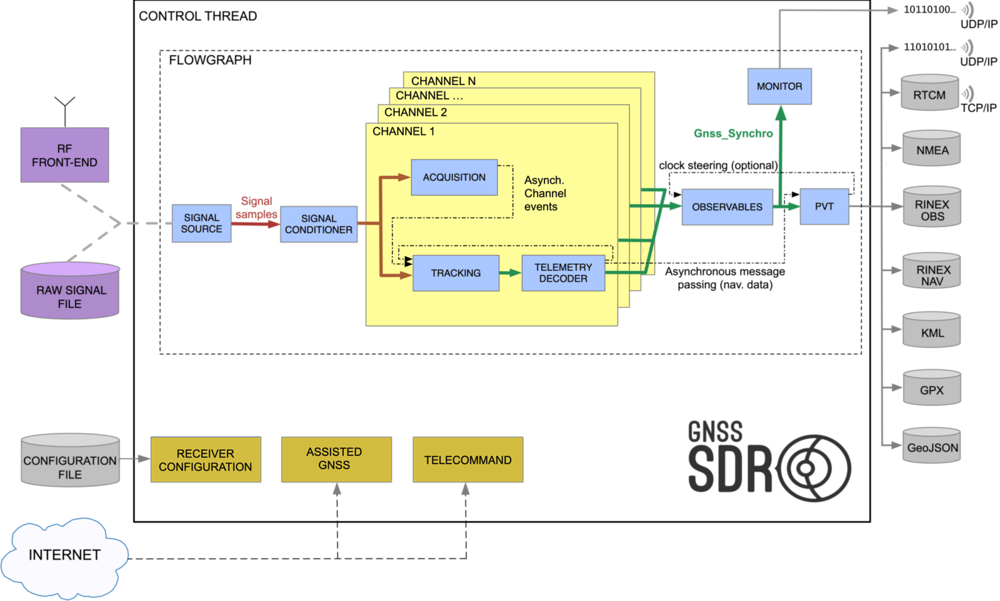

**Welcome to GNSS-SDR!**

Visit [gnss-sdr.org](http://gnss-sdr.org "GNSS-SDR's Homepage") for more information about this open source GNSS software defined receiver.

If you have questions about GNSS-SDR, please [subscribe to the gnss-sdr-developers mailing list](http://lists.sourceforge.net/lists/listinfo/gnss-sdr-developers "Subscribe to the gnss-sdr-developers mailing list" ) and post your questions there.

   

# How to build GNSS-SDR


This section describes how to set up the compilation environment in GNU/Linux or [Mac OS X](#macosx), and to build GNSS-SDR. See also [our Building Guide](http://gnss-sdr.org/documentation/building-guide "GNSS-SDR's Building Guide").

GNU/Linux 
----------

 * Tested distributions: Ubuntu 14.04 LTS, 14.10 and 15.04, Debian 8.0 "jessie", Linaro 15.03 
 * Known to work but not continually tested: Fedora 19 and 20, and openSUSE 13.1 
 * Supported microprocessor architectures: 
   * i386: Intel x86 instruction set (32-bit microprocessors). 
   * amd64: also known as x86-64, the 64-bit version of the x86 instruction set, originally created by AMD and implemented by AMD, Intel, VIA and others.
   * armel: ARM embedded ABI, supported on ARM v4t and higher.
   * armhf: ARM hard float, ARMv7 + VFP3-D16 floating-point hardware extension + Thumb-2 instruction set and above. 
   * arm64: ARM 64 bits or ARMv8.

Older distribution releases might work as well, but you will need GCC 4.7 or newer.

Before building GNSS-SDR, you need to install all the required dependencies. If you are using Debian 8, Ubuntu 14.10 or above, this can be done by copying and pasting the following line in a terminal:

~~~~~~ 
$ sudo apt-get install build-essential cmake git libboost-dev libboost-date-time-dev \
       libboost-system-dev libboost-filesystem-dev libboost-thread-dev libboost-chrono-dev \
       libboost-serialization-dev libboost-program-options-dev libboost-test-dev \
       liblog4cpp5-dev libuhd-dev gnuradio-dev gr-osmosdr libblas-dev liblapack-dev \
       libarmadillo-dev libgflags-dev libgoogle-glog-dev libssl-dev libgtest-dev
~~~~~~

Once you have installed these packages, you can jump directly to [how to download the source code and build GNSS-SDR](#download-and-build-linux). Alternatively, if you need to manually install those libraries, please keep reading. 

Note for Ubuntu 14.04 LTS "trusty" users: you will need to build from source and install GNU Radio manually, as explained below, since GNSS-SDR requires gnuradio-dev >= 3.7.3, and Ubuntu 14.04 came with 3.7.2. Install all the packages above BUT EXCEPT ```libuhd-dev```, ```gnuradio-dev``` and ```gr-osmosdr``` (and remove them if they are already installed in your machine), and install those dependencies using PyBOMBS. 

### Manual installation of GNU Radio

Downloading, building and installing [GNU Radio](http://gnuradio.org/redmine/projects/gnuradio/wiki "GNU Radio's Homepage") and all its dependencies is not a simple task. We recommend to use [PyBOMBS](http://gnuradio.org/redmine/projects/pybombs/wiki "Python Build Overlay Managed Bundle System wiki") (Python Build Overlay Managed Bundle System), the GNU Radio install management system that automatically does all the work for you. In a terminal, type:


~~~~~~ 
$ git clone git://github.com/pybombs/pybombs 
$ cd pybombs
~~~~~~

Configure PyBOMBS:

~~~~~~
$ ./pybombs config 
~~~~~~

You can safely accept the default options but for ```prefix```. We recommend to put ```/usr/local``` there. After the configuration, you should get something similar to:

~~~~~~
gituser = username
prefix = /usr/local
satisfy_order = deb,src  # For Debian/Ubuntu/LinuxMint
satisfy_order = rpm,src  # For Fedora/CentOS/RHEL/openSUSE
forcepkgs =
forcebuild = gnuradio,uhd,gr-osmosdr,rtl-sdr
timeout = 30
cmakebuildtype = RelWithDebInfo
builddocs = OFF
cc = gcc
cxx = g++
makewidth = 4
~~~~~~


Then, you are ready to download and install [UHD](http://files.ettus.com/uhd_docs/manual/html/) (the Universal Hardware Driver), GNU Radio and all their required dependencies by doing:

~~~~~~
$ sudo ./pybombs install uhd gnuradio
~~~~~~

This can take some time (up to two hours to complete, depending on your system), and downloads, builds and installs the latest versions of the Universal Hardware Driver (UHD) and GNU Radio in your system, including all their dependencies. 
In case you do not want to use PyBOMBS and prefer to build and install GNU Radio step by step, follow instructions at the [GNU Radio Build Guide](http://gnuradio.org/redmine/projects/gnuradio/wiki/BuildGuide).

    
    
### Manual installation of other required dependencies

#### Install the [Armadillo](http://arma.sourceforge.net/ "Armadillo's Homepage") C++ linear algebra library:

~~~~~~
$ sudo apt-get install libopenblas-dev liblapack-dev   # For Debian/Ubuntu/LinuxMint
$ sudo yum install lapack-devel blas-devel             # For Fedora/CentOS/RHEL
$ sudo zypper install lapack-devel blas-devel          # For OpenSUSE
$ wget http://sourceforge.net/projects/arma/files/armadillo-5.400.2.tar.gz
$ tar xvfz armadillo-5.400.2.tar.gz
$ cd armadillo-5.400.2
$ cmake .
$ make
$ sudo make install
~~~~~~

The full stop separated from ```cmake``` by a space is important. [CMake](http://www.cmake.org/ "CMake's Homepage") will figure out what other libraries are currently installed and will modify Armadillo's configuration correspondingly. CMake will also generate a run-time armadillo library, which is a combined alias for all the relevant libraries present on your system (eg. BLAS, LAPACK and ATLAS).

   

#### Install [Gflags](https://github.com/gflags/gflags "Gflags' Homepage"), a commandline flags processing module for C++:

~~~~~~ 
$ wget https://github.com/gflags/gflags/archive/v2.1.2.tar.gz
$ tar xvfz v2.1.2.tar.gz
$ cd gflags-2.1.2
$ cmake -DBUILD_SHARED_LIBS=ON -DBUILD_STATIC_LIBS=OFF -DBUILD_gflags_nothreads_LIB=OFF .
$ make
$ sudo make install
$ sudo ldconfig
~~~~~~ 

   

#### Install [Glog](https://github.com/google/glog "Glog's Homepage"), a library that implements application-level logging:

~~~~~~ 
$ wget https://github.com/google/glog/archive/v0.3.4.tar.gz 
$ tar xvfz v0.3.4.tar.gz 
$ cd glog-0.3.4
$ ./configure
$ make
$ sudo make install
$ sudo ldconfig
~~~~~~ 

   

#### Build the [Google C++ Testing Framework](https://github.com/google/googletest "Googletest Homepage"), also known as googletest:

~~~~~~ 
$ wget https://github.com/google/googletest/archive/release-1.7.0.zip
$ unzip release-1.7.0.zip
$ cd googletest-release-1.7.0
$ cmake .
$ make
~~~~~~ 

Please **DO NOT install** googletest (do *not* type ```sudo make install```). Every user needs to compile his tests using the same compiler flags used to compile the installed Google Test libraries; otherwise he may run into undefined behaviors (i.e. the tests can behave strangely and may even crash for no obvious reasons). The reason is that C++ has this thing called the One-Definition Rule: if two C++ source files contain different definitions of the same class/function/variable, and you link them together, you violate the rule. The linker may or may not catch the error (in many cases it is not required by the C++ standard to catch the violation). If it does not, you get strange run-time behaviors that are unexpected and hard to debug. If you compile Google Test and your test code using different compiler flags, they may see different definitions of the same class/function/variable (e.g. due to the use of ```#if``` in Google Test). Therefore, for your sanity, we recommend to avoid installing pre-compiled Google Test libraries. Instead, each project should compile Google Test itself such that it can be sure that the same flags are used for both Google Test and the tests. The building system of GNSS-SDR does the compilation and linking of googletest to its own tests; it is only required that you tell the system where the googletest folder that you downloaded resides. Just add to your ```$HOME/.bashrc``` file the following line:

~~~~~~ 
export GTEST_DIR=/home/username/gtest-1.7.0
~~~~~~ 

changing /home/username/gtest-1.7.0 by the actual directory where you downloaded googletest. 

   

#### Install the [SSL development libraries](https://www.openssl.org/ "OpenSSL's Homepage"):

~~~~~~ 
$ sudo apt-get install libssl-dev    # For Debian/Ubuntu/LinuxMint
$ sudo yum install openssl-devel     # For Fedora/CentOS/RHEL
~~~~~~ 

   

### <a name="download-and-build-linux">Clone GNSS-SDR's Git repository</a>:

~~~~~~ 
$ git clone git://github.com/gnss-sdr/gnss-sdr
~~~~~~ 

Cloning the GNSS-SDR repository as in the line above will create a folder named gnss-sdr with the following structure:

~~~~~~ 
 |-gnss-sdr
 |---build      <- where gnss-sdr is built.
 |---cmake      <- CMake-related files.
 |---conf       <- Configuration files. Each file defines one particular receiver.
 |---data       <- Populate this folder with your captured data.
 |---docs       <- Contains documentation-related files.
 |---drivers    <- Drivers for some RF front-ends.
 |---firmware   <- Firmware for some front-ends.
 |---install    <- Executables will be placed here. 
 |---src        <- Source code folder.
 |-----algorithms  <- Signal processing blocks.
 |-----core     <- Control plane, interfaces, systems' parameters.
 |-----main     <- Main function of the C++ program.
 |-----tests    <- QA code.
 |-----utils    <- some utilities (e.g. Matlab scripts).
~~~~~~ 

By default, you will be in the 'master' branch of the Git repository, which corresponds to the lastest stable release. If you want to try the latest developments, you can use the 'next' branch by going to the newly created gnss-sdr folder doing:

~~~~~~ 
$ git checkout next
~~~~~~ 

More information about GNSS-SDR-specific Git usage and pointers to further readings can be found at out guide about [how to contribute to the source code](http://gnss-sdr.org/documentation/how-contribute-source-code "How to contribute to the source code").


### Build and install GNSS-SDR

Go to GNSS-SDR's build directory:

~~~~~~ 
$ cd gnss-sdr/build
~~~~~~ 

Configure and build the application:

~~~~~~ 
$ cmake ../
$ make
~~~~~~ 

By default, CMake will build the Release version, meaning that the compiler will generate a fast, optimized executable. This is the recommended build type when using a RF front-end and you need to attain real time. If working with a file (and thus without real-time constraints), you may want to obtain more information about the internals of the receiver, as well as more fine-grained logging. This can be done by building the Debug version, by doing:

~~~~~~ 
$ cmake -DCMAKE_BUILD_TYPE=Debug ../
$ make
~~~~~~ 

This will create four executables at gnss-sdr/install, namely ```gnss-sdr```, ```run_tests```, ```front-end-cal``` and ```volk_gnsssdr_profile```. You can run them from that folder, but if you prefer to install ```gnss-sdr``` on your system and have it available anywhere else, do:

~~~~~~ 
$ sudo make install
~~~~~~ 

This will also make a copy of the conf/ folder into /usr/local/share/gnss-sdr/conf for your reference. We suggest to create a working directory at your preferred location and store your own configuration and data files there.

You could be interested in creating the documentation by doing:

~~~~~~ 
$ make doc
~~~~~~ 

from the gnss-sdr/build folder. This will generate HTML documentation that can be retrieved pointing your browser of preference to gnss-sdr/docs/html/index.html.
If a LaTeX installation is detected in your system,

~~~~~~ 
$ make pdfmanual
~~~~~~ 

will create a PDF manual at gnss-sdr/docs/GNSS-SDR_manual.pdf. Finally,

~~~~~~ 
$ make doc-clean
~~~~~~ 

will remove the content of previously-generated documentation.

GNSS-SDR comes with a library with some specific Vector-Optimized Library of Kernels (VOLK) and a profiler that will build a config file for the best SIMD architecture for your processor. Run ``volk_gnsssdr_profile`` that is installed into $PREFIX/bin. This program tests all known VOLK kernels for each architecture supported by the processor. When finished, it will write to $HOME/.volk_gnsssdr/volk_gnsssdr_config the best architecture for the VOLK function. This file is read when using a function to know the best version of the function to execute. It mimics GNU Radio's VOLK library, so if you still have not run ```volk_profile```, this is a good moment to do so.  


If you are using Eclipse as your development environment, CMake can create the project for you. Type:

~~~~~~ 
$ cmake -G "Eclipse CDT4 - Unix Makefiles" -DCMAKE_BUILD_TYPE=Debug -DECLIPSE_CDT4_GENERATE_SOURCE_PROJECT=TRUE -DCMAKE_ECLIPSE_VERSION=3.7 -DCMAKE_ECLIPSE_MAKE_ARGUMENTS=-j8 ../
~~~~~~ 

and then import the created project file into Eclipse:

1. Import project using Menu File -> Import.
2. Select General -> Existing projects into workspace.
3. Browse where your build tree is and select the root build tree directory. Keep "Copy projects into workspace" unchecked.
4. You get a fully functional Eclipse project.   


###### Build GN3S V2 Custom firmware and driver (OPTIONAL):

Go to GR-GN3S root directory, compile and install the driver (read the drivers/gr-gn3s/README for more information):

~~~~~~   
$ cd gnss-sdr/drivers/gr-gn3s
$ cd build
$ cmake ../
$ make
$ sudo make install
$ sudo ldconfig
~~~~~~ 

Then configure GNSS-SDR to build the GN3S_Signal_Source by:

~~~~~~ 
$ cmake -DENABLE_GN3S=ON ../
$ make
$ sudo make install
~~~~~~ 

In order to gain access to USB ports, gnss-sdr should be used as root. In addition, the driver requires access to the GN3S firmware binary file. It should be available in the same path where the application is called.
GNSS-SDR comes with a pre-compiled custom GN3S firmware available at gnss-sdr/firmware/GN3S_v2/bin/gn3s_firmware.ihx. Please copy this file to the application path. The GNSS-SDR default path is gnss-sdr/install

(in order to disable the GN3S_Signal_Source compilation, you can pass -DENABLE_GN3S=OFF to cmake and build GNSS-SDR again).

More info at [drivers/gr-gn3s/README.md](./drivers/gr-gn3s/README.md)
   

###### Build OSMOSDR support (OPTIONAL):

Install the [OsmoSDR](http://sdr.osmocom.org/trac/ "OsmoSDR's Homepage") library and GNU Radio's source block: 


~~~~~~ 
$ git clone git://git.osmocom.org/osmo-sdr.git
$ cd osmo-sdr/software/libosmosdr
$ mkdir build
$ cd build/
$ cmake ../
$ make
$ sudo make install
$ sudo ldconfig
$ cd ../../
$ git clone git://git.osmocom.org/gr-osmosdr
$ cd gr-osmosdr
$ mkdir build
$ cd build
$ cmake ../ -Wno-dev
$ make
$ sudo make install
$ sudo ldconfig
~~~~~~ 


Then, configure GNSS-SDR to build the Osmosdr_Signal_Source by:

~~~~~~ 
$ cmake -DENABLE_OSMOSDR=ON ../
$ make
$ sudo make install
~~~~~~ 

(in order to disable the Osmosdr_Signal_Source compilation, you can pass -DENABLE_OSMOSDR=OFF to cmake and build GNSS-SDR again).


###### Build OpenCL support (OPTIONAL):

In order to enable the building of blocks that use OpenCL, type:

~~~~~~ 
$ cmake -DENABLE_OPENCL=ON ../
$ make
$ sudo make install
~~~~~~ 


###### Build CUDA support (OPTIONAL):

In order to enable the building of blocks that use CUDA, NVIDIA's parallel programming model that enables graphics processing unit (GPU) acceleration for data-parallel computations, first you need to install the CUDA Toolkit from [NVIDIA Developers Download page](https://developer.nvidia.com/cuda-downloads "CUDA Downloads"). Make sure that the SDK samples build well. Then, build GNSS-SDR by doing:

~~~~~~ 
$ cmake -DENABLE_CUDA=ON ../
$ make
$ sudo make install
~~~~~~ 

Of course, you will also need a GPU that [supports CUDA](https://developer.nvidia.com/cuda-gpus "CUDA GPUs").


###### Build a portable binary

In order to build an executable that not depends on the specific SIMD instruction set that is present in the processor of the compiling machine, so other users can execute it in other machines without those particular sets, use:

~~~~~~ 
$ cmake -DENABLE_GENERIC_ARCH=ON ../
$ make 
$ sudo make install
~~~~~~ 

Using this option, all SIMD instructions are exclusively accessed via VOLK, which automatically includes versions of each function for different SIMD instruction sets, then detects at runtime which to use, or if there are none, substitutes a generic, non-SIMD implementation.


<a name="macosx">Mac OS X</a> 
---------


### Mac OS X 10.9 (Mavericks) and 10.10 (Yosemite)

If you still have not installed [Xcode](http://developer.apple.com/xcode/), do it now from the App Store (it's free). You will also need the Xcode Command Line Tools. Launch the Terminal, found in /Applications/Utilities/, and type:

~~~~~~ 
$ xcode-select --install
~~~~~~ 

Agree to Xcode license: 

~~~~~~ 
$ sudo xcodebuild -license
~~~~~~ 

Then, [install Macports](http://www.macports.org/install.php). If you are upgrading from a previous installation, please follow the [migration rules](http://trac.macports.org/wiki/Migration).

In a terminal, type:

~~~~~~ 
$ sudo port selfupdate
$ sudo port upgrade outdated
$ sudo port install doxygen +latex
$ sudo port install gnuradio
$ sudo port install armadillo
$ sudo port install google-glog +gflags
~~~~~~ 

You also might need to activate a Python installation. The list of installed versions can be retrieved with:

~~~~~~ 
$ port select list python
~~~~~~ 

and you can activate a certain version (2.7 works well) by typing:

~~~~~~ 
$ sudo port select --set python python27
~~~~~~ 

Finally, you are ready to clone the GNSS-SDR repository and build the software:

~~~~~~ 
$ git clone git://github.com/gnss-sdr/gnss-sdr
$ cd gnss-sdr/build
$ cmake -DCMAKE_CXX_COMPILER=/usr/bin/clang++ ../
$ make
~~~~~~ 

This will create three executables at gnss-sdr/install, namely ```gnss-sdr```, ```run_tests``` and ```volk_gnsssdr_profile```. You can install the software receiver on your system by doing:

~~~~~~ 
$ sudo make install
~~~~~~ 


The documentation can be built by:

~~~~~~ 
$ make doc
~~~~~~ 

and can be viewed doing:

~~~~~~ 
$ open ../docs/html/index.html
~~~~~~ 

GNSS-SDR comes with a library with some specific Vector-Optimized Library of Kernels (VOLK) and a profiler that will build a config file for the best SIMD architecture for your processor. Run ``volk_gnsssdr_profile`` that is installed into $PREFIX/bin. This program tests all known VOLK kernels for each architecture supported by the processor. When finished, it will write to $HOME/.volk_gnsssdr/volk_gnsssdr_config the best architecture for the VOLK function. This file is read when using a function to know the best version of the function to execute. It mimics GNU Radio's VOLK library, so if you still have not run ```volk_profile```, this is a good moment to do so.


Updating GNSS-SDR
=================

If you cloned GNSS-SDR some days ago, it is possible that some developer has updated files at the Git repository. You can update your working copy by doing:

~~~~~~ 
$ git checkout master      # Switch to branch you want to update
$ git pull origin master   # Download the newest code from our repository
~~~~~~ 

or, if you want to test the lastest developments:

~~~~~~ 
$ git checkout next 
$ git pull origin next 
~~~~~~ 

Before rebuilding the source code, it is safe (and recommended) to remove the remainders of old compilations:

~~~~~~ 
$ rm -rf gnss-sdr/build/*
~~~~~~ 

If you are interested in contributing to the development of GNSS-SDR, please check out [how to do it](http://gnss-sdr.org/documentation/how-contribute-source-code "How to contribute to GNSS-SDR source code").

There is a more controlled way to upgrade your repository, which is to use the Git commands ```fetch``` and ```merge```, as described [here](http://gnss-sdr.org/source-code). 

   


Getting started
===============


1. After building the code, you will find the ```gnss-sdr``` executable file at gnss-sdr/install. You can make it available everywhere else by ```sudo make install```. Run the profilers ```volk_profile``` and ```volk_gnsssdr_profile``` for testing all available VOLK kernels for each architecture supported by your processor. This only has to be done once.
2. In post-processing mode, you have to provide a captured GNSS signal file.
    1. The signal file can be easily recorded using the GNU Radio file sink in ```gr_complex<float>``` mode.
    2. You will need a GPS active antenna, a [USRP](http://www.ettus.com/product) and a suitable USRP daughter board to receive GPS L1 C/A signals. GNSS-SDR require to have at least 2 MHz of bandwidth in 1.57542 GHz. (remember to enable the DC bias with the daughter board jumper).
We use a [DBSRX2](https://www.ettus.com/product/details/DBSRX2) to do the task, but you can try the newer Ettus' daughter boards as well. 
    3. The easiest way to capture a signal file is to use the GNU Radio Companion GUI. Only two blocks are needed: a USRP signal source connected to complex float file sink. You need to tune the USRP central frequency and decimation factor using USRP signal source properties box. We suggest using a decimation factor of 20 if you use the USRP2. This will give you 100/20 = 5 MSPS which will be enough to receive GPS L1 C/A signals. The front-end gain should also be configured. In our test with the DBSRX2 we obtained good results with ```G=50```.
    4. Capture at least 80 seconds of signal in open sky conditions. During the process, be aware of USRP driver buffer underuns messages. If your hard disk is not fast enough to write data at this speed you can capture to a virtual RAM drive. 80 seconds of signal at 5 MSPS occupies less than 3 Gbytes using ```gr_complex<float>```.
    5. If you have no access to a RF front-end, you can download a sample raw data file (that contains GPS and Galileo signals) from [here](http://sourceforge.net/projects/gnss-sdr/files/data/).
3. You are ready to configure the receiver to use your captured file among other parameters:
    1. The default configuration file resides at [/usr/local/share/gnss-sdr/conf/default.conf](./conf/gnss-sdr.conf).
    2. You need to review/modify at least the following settings:
        * ```SignalSource.filename=``` (absolute or relative route to your GNSS signal captured file)
        * ```GNSS-SDR.internal_fs_hz=``` (captured file sampling rate in Hz)
        * ```SignalSource.sampling_frequency=``` (captured file sampling rate in Hz)
        * ```SignalConditioner.sample_freq_in=``` (captured file sampling rate in Hz)
        * ```SignalConditioner.sample_freq_out=``` (captured file sampling rate in Hz)
        * ```TelemetryDecoder.fs_in=``` (captured file sampling rate in Hz)
    3. The configuration file has in-line documentation, you can try to tune the number of channels and several receiver parameters. Store your .conf file in some working directory of your choice.
4. Run the receiver invoking the configuration by
```$ gnss-sdr --config_file=/path/to/my_receiver.conf```
The program reports the current status in text mode, directly to the terminal window. If all goes well, and GNSS-SDR is able to successfully track and decode at least 4 satellites, you will get PVT fixes. The program will write a .kml file and RINEX (yet experimental) files in the install directory. In addition to the console output, GNSS-SDR also writes log files at /tmp/ (configurable with the commandline flag ```./gnss-sdr --log_dir=/path/to/log```).

   


Using GNSS-SDR
==============

With GNSS-SDR, you can define you own receiver, work with captured raw data or from a RF front-end, dump into files intermediate signals, or tune every single algorithm used in the signal processing. All the configuration is done in a single file. Those configuration files reside at the [gnss-sdr/conf/](./conf/) folder (or at /usr/local/share/gnss-sdr/conf if you installed the program). By default, the executable ```gnss-sdr``` will read the configuration available at ```gnss-sdr/conf/gnss-sdr.conf``` (or at (usr/local/share/gnss-sdr/conf/default.conf if you installed the program). You can edit that file to fit your needs, or even better, define a new ```my_receiver.conf``` file with your own configuration. This new receiver can be generated by invoking gnss-sdr with the ```--config_file``` flag pointing to your configuration file:

~~~~~~ 
$ gnss-sdr --config_file=/path/to/my_receiver.conf
~~~~~~ 

You can see a guide of available implementations at ```gnss-sdr/conf/master.conf```. That folder contains other working examples as well. If you have a working configuration and want to share it will others, please tell us and we will be happy to upload it to the server.

You can use a single configuration file for processing different data files, specifying the file to be processed with the ```--signal_source``` flag:

~~~~~~ 
$ gnss-sdr --config_file=../conf/my_receiver.conf --signal_source=../data/my_captured_data.dat
~~~~~~ 


This will override the ```SignalSource.filename``` specified in the configuration file.

   


Control plane
-------------



GNSS-SDR's main method initializes the logging library, processes the command line flags, if any, provided by the user and instantiates a [ControlThread](./src/core/receiver/control_thread.h) object. Its constructor reads the configuration file, creates a control queue and creates a flowgraph according to the configuration. Then, the program's main method calls the run() method of the instantiated object, an action that connects the flowgraph and starts running it. After that, and until a stop message is received, it reads control messages sent by the receiver's modules through a safe-thread queue and processes them. Finally, when a stop message is received, the main method executes the destructor of the ControlThread object, which deallocates memory, does other cleanup and exits the program.

The [GNSSFlowgraph](./src/core/receiver/gnss_flowgraph.h) class is responsible for preparing the graph of blocks according to the configuration, running it, modifying it during run-time and stopping it. Blocks are identified by its role. This class knows which roles it has to instantiate and how to connect them. It relies on the configuration to get the correct instances of the roles it needs and then it applies the connections between GNU Radio blocks to make the graph ready to be started. The complexity related to managing the blocks and the data stream is handled by GNU Radio's ```gr::top_block``` class. GNSSFlowgraph wraps the ```gr::top_block``` instance so we can take advantage of the ```gnss_block_factory``` (see below), the configuration system and the processing blocks. This class is also responsible for applying changes to the configuration of the flowgraph during run-time, dynamically reconfiguring channels: it selects the strategy for selecting satellites. This can range from a sequential search over all the satellites' ID to other more efficient approaches.

The Control Plane is in charge of creating a flowgraph according to the configuration and then managing the modules. Configuration allows users to define in an easy way their own custom receiver by specifying the flowgraph (type of signal source, number of channels, algorithms to be used for each channel and each module, strategies for satellite selection, type of output format, etc.). Since it is difficult to foresee what future module implementations will be needed in terms of configuration, we used a very simple approach that can be extended without a major impact in the code. This can be achieved by simply mapping the names of the variables in the modules with the names of the parameters in the configuration.

   

### Configuration

Properties are passed around within the program using the [ConfigurationInterface](./src/core/interfaces/configuration_interface.h) class. There are two implementations of this interface: [FileConfiguration](./src/core/receiver/file_configuration.h) and [InMemoryConfiguration](./src/core/receiver/in_memory_configuration.h). FileConfiguration reads the properties (pairs of property name and value) from a file and stores them internally. InMemoryConfiguration does not read from a file; it remains empty after instantiation and property values and names are set using the set property method. FileConfiguration is intended to be used in the actual GNSS-SDR application whereas InMemoryConfiguration is intended to be used in tests to avoid file-dependency in the file system. Classes that need to read configuration parameters will receive instances of ConfigurationInterface from where they will fetch the values. For instance, parameters related to SignalSource should look like this:

~~~~~~ 
SignalSource.parameter1=value1
SignalSource.parameter2=value2
~~~~~~ 

The name of these parameters can be anything but one reserved word: implementation. This parameter indicates in its value the name of the class that has to be instantiated by the factory for that role. For instance, if our signal source is providing data already at baseband and thus we want to use the implementation [Pass_Through](./src/algorithms/libs/pass_through.h) for module SignalConditioner, the corresponding line in the configuration file would be

~~~~~~ 
SignalConditioner.implementation=Pass_Through
~~~~~~ 

Since the configuration is just a set of property names and values without any meaning or syntax, the system is very versatile and easily extendable. Adding new properties to the system only implies modifications in the classes that will make use of these properties. In addition, the configuration files are not checked against any strict syntax so it is always in a correct status (as long as it contains pairs of property names and values in the [INI format](http://en.wikipedia.org/wiki/INI_file)).

   

### GNSS block factory

Hence, the application defines a simple accessor class to fetch the configuration pairs of values and passes them to a factory class called [GNSSBlockFactory](./src/core/receiver/gnss_block_factory.h). This factory decides, according to the configuration, which class needs to be instantiated and which parameters should be passed to the constructor. Hence, the factory encapsulates the complexity of blocks' instantiation. With that approach, adding a new block that requires new parameters will be as simple as adding the block class and modifying the factory to be able to instantiate it. This loose coupling between the blocks' implementations and the syntax of the configuration enables extending the application capacities in a high degree. It also allows to produce fully customized receivers, for instance a testbed for acquisition algorithms, and to place observers at any point of the receiver chain.

   


Signal Processing plane
-----------------------

GNU Radio's class ```gr::basic_block``` is the abstract base class for all signal processing blocks, a bare abstraction of an entity that has a name and a set of inputs and outputs. It is never instantiated directly; rather, this is the abstract parent class of both ```gr::hier_block2```, which is a recursive container that adds or removes processing or hierarchical blocks to the internal graph, and ```gr::block```, which is the abstract base class for all the processing blocks. 


A signal processing flow is constructed by creating a tree of hierarchical blocks, which at any level may also contain terminal nodes that actually implement signal processing functions.

Class ```gr::top_block``` is the top-level hierarchical block representing a flowgraph. It defines GNU Radio runtime functions used during the execution of the program: run(), start(), stop(), wait(), etc. A a subclass called [GNSSBlockInterface](./src/core/interfaces/gnss_block_interface.h) is the common interface for all the GNSS-SDR modules. It defines pure virtual methods, that are required to be implemented by a derived class.

Subclassing GNSSBlockInterface, we defined interfaces for the GNSS receiver blocks depicted in the figure above. This hierarchy provides the definition of different algorithms and different implementations, which will be instantiated according to the configuration. This strategy allows multiple implementations sharing a common interface, achieving the objective of decoupling interfaces from implementations: it defines a family of algorithms, encapsulates each one, and makes them interchangeable. Hence, we let the algorithm vary independently from the program that uses it.

Internally, GNSS-SDR makes use of the complex data types defined by [VOLK](http://libvolk.org/ "Vector-Optimized Library of Kernels home"). They are fundamental for handling sample streams in which samples are complex numbers with real and imaginary components of 8, 16 or 32 bits, common formats delivered by GNSS (and generic SDR) radio frequency front-ends. The following list shows the data type names that GNSS-SDR exposes through the configuration file:

- **`byte`**: Signed integer, 8-bit two's complement number ranging from -128 to 127. C++ type name: `int8_t`. 
- **`short`**: Signed integer, 16-bit two's complement number ranging from -32768 to 32767.  C++ type name: `int16_t` .
- **`float`**:  Defines numbers with fractional parts, can represent values ranging from approx. 1.5e-45 to 3.4e+38 with a precision of 7 digits (32 bits). C++ type name: `float`.
- **`ibyte`**: Interleaved (I&Q) stream of samples of type `byte`. C++ type name: `int8_t`.
- **`ishort`**: Interleaved (I&Q) stream of samples of type `short`. C++ type name: `int16_t`.
- **`cbyte`**: Complex samples, with real and imaginary parts of type `byte`. C++ type name: `lv_8sc_t`.
- **`cshort`**: Complex samples, with real and imaginary parts of type `short`. C++ type name: `lv_16sc_t`.
- **`gr_complex`**: Complex samples, with real and imaginary parts of type `float`. C++ type name: `std::complex<float>`.


###  Signal Source

The input of a software receiver are the raw bits that come out from the front-end's analog-to-digital converter (ADC). Those bits can be read from a file stored in the hard disk or directly in real-time from a hardware device through USB or Ethernet buses. 

The Signal Source module is in charge of implementing the hardware driver, that is, the portion of the code that communicates with the RF front-end and receives the samples coming from the ADC. This communication is usually performed through USB or Ethernet buses. Since real-time processing requires a highly optimized implementation of the whole receiver, this module also allows to read samples from a file stored in a hard disk, and thus processing without time constraints. Relevant parameters of those samples are the intermediate frequency (or baseband I&Q components), the sampling rate and number of bits per sample, that must be specified by the user in the configuration file.

This module also performs bit-depth adaptation, since most of the existing RF front-ends provide samples quantized with 2 or 3 bits, while operations inside the processor are performed on 32- or 64-bit words, depending on its architecture. Although there are implementations of the most intensive computational processes (mainly correlation) that take advantage of specific data types and architectures for the sake of efficiency, the approach is processor-specific and hardly portable. We suggest to keep signal samples in standard data types and letting the compiler select the best library version (implemented using SIMD or any other processor-specific technology) of the required routines for a given processor.
 
***Example: FileSignalSource***

The user can configure the receiver for reading from a file, setting in the configuration file the data file location, sample format, and the sampling frequency and intermediate frequency at what the signal was originally captured.
 
~~~~~~ 
;######### SIGNAL_SOURCE CONFIG ############
SignalSource.implementation=File_Signal_Source
SignalSource.filename=/home/user/gnss-sdr/data/my_capture.dat
SignalSource.item_type=gr_complex
SignalSource.sampling_frequency=4000000 ; Sampling frequency in [Hz]
SignalSource.freq=1575420000 ; RF front-end center frequency in [Hz] 
~~~~~~  

Type ```gr_complex``` refers to a GNU Radio typedef equivalent to ```std::complex<float>```. In order to save some storage space, you might wanted to store your signal in a more efficient format such as an I/Q interleaved ```short`` integer sample stream. In that case, change the corresponding line to:

~~~~~~ 
SignalSource.item_type=short
~~~~~~ 

In this latter case, you will need to convert the interleaved I/Q samples to a complex stream via Data Type Adapter block (see below).

***Example: UhdSignalSource***

The user may prefer to use a [UHD](http://code.ettus.com/redmine/ettus/projects/uhd/wiki)-compatible RF front-end and try real-time processing. For instance, for a USRP1 + DBSRX daughterboard, use:

~~~~~~ 
;######### SIGNAL_SOURCE CONFIG ############
SignalSource.implementation=UHD_Signal_Source
SignalSource.item_type=gr_complex
SignalSource.sampling_frequency=4000000 ; Sampling frequency in [Hz]
SignalSource.freq=1575420000 ; RF front-end center frequency in [Hz] 
SignalSource.gain=60 ; Front-end gain in dB
SignalSource.subdevice=B:0 ; UHD subdevice specification (for USRP1 use A:0 or B:0, for USRP B210 use A:0)
~~~~~~ 

Other examples are available at [gnss-sdr/conf/](./conf/).


### Signal Conditioner


The signal conditioner is in charge of resampling the signal and delivering a reference sample rate to the downstream processing blocks, acting as a facade between the signal source and the synchronization channels, providing a simplified interface to the input signal. In case of multiband front-ends, this module would be in charge of providing a separated data stream for each band.

If your signal source is providing baseband signal samples of type ```gr_complex``` at 4 Msps, you can bypass the Signal Conditioner block by:

~~~~~~ 
SignalConditioner.implementation=Pass_Through
~~~~~~ 

If you need to adapt some aspect of you signal, you can enable the Signal Conditioner and configure three internal blocks: a data type adpater, an input signal and a resampler.

~~~~~~ 
;#[Signal_Conditioner] enables this block. Then you have to configure [DataTypeAdapter], [InputFilter] and [Resampler] blocks
SignalConditioner.implementation=Signal_Conditioner
~~~~~~ 
   

#### Data type adapter

This block changes the type of input data samples. If your signal source delivers data samples of type ```short```, you can use this block to convert them to ```gr_complex``` like this:

~~~~~~ 
;######### DATA_TYPE_ADAPTER CONFIG ############
;#implementation: [Pass_Through] disables this block
DataTypeAdapter.implementation=Ishort_To_Complex
~~~~~~ 

   

#### Input filter

This blocks filters the input data. It can be combined with frequency translation for IF signals. The computation of the filter taps is based on parameters of GNU Radio's function [pm_remez](http://gnuradio.org/doc/doxygen/pm__remez_8h.html), that calculates the optimal (in the Chebyshev/minimax sense) FIR filter impulse response given a set of band edges, the desired reponse on those bands, and the weight given to the error in those bands. 

The block can be configured like this:

~~~~~~ 
;######### INPUT_FILTER CONFIG ############
;#implementation: Use [Pass_Through] or [Fir_Filter] or [Freq_Xlating_Fir_Filter]
;#[Pass_Through] disables this block
;#[Fir_Filter] enables a FIR Filter
;#[Freq_Xlating_Fir_Filter] enables FIR filter and a composite frequency translation that shifts IF down to zero Hz.
InputFilter.implementation=Freq_Xlating_Fir_Filter
InputFilter.dump=false ; #dump: Dump the filtered data to a file.
InputFilter.dump_filename=../data/input_filter.dat ; #dump_filename: Log path and filename.
InputFilter.input_item_type=gr_complex
InputFilter.output_item_type=gr_complex
InputFilter.taps_item_type=float
InputFilter.number_of_taps=5 ; #number_of_taps: Number of taps in the filter. Increasing this parameter increases the processing time
InputFilter.number_of_bands=2 ; #number_of_bands: Number of frequency bands in the filter.
; Frequency is in the range [0, 1], with 1 being the Nyquist frequency (Fs/2)
; The number of band_begin and band_end elements must match the number of bands
InputFilter.band1_begin=0.0
InputFilter.band1_end=0.85
InputFilter.band2_begin=0.90
InputFilter.band2_end=1.0

;#ampl: desired amplitude at the band edges.
;#The number of ampl_begin and ampl_end elements must match the number of bands
InputFilter.ampl1_begin=1.0
InputFilter.ampl1_end=1.0
InputFilter.ampl2_begin=0.0
InputFilter.ampl2_end=0.0

;#band_error: weighting applied to each band (usually 1).
;#The number of band_error elements must match the number of bands
InputFilter.band1_error=1.0
InputFilter.band2_error=1.0

;#filter_type: one of "bandpass", "hilbert" or "differentiator" 
InputFilter.filter_type=bandpass

;#grid_density: determines how accurately the filter will be constructed.
;The minimum value is 16; higher values are slower to compute the filter.
InputFilter.grid_density=16

;#The following options are used only in Freq_Xlating_Fir_Filter implementation.
;#InputFilter.IF is the intermediate frequency (in Hz) shifted down to zero Hz
InputFilter.sampling_frequency=4000000
InputFilter.IF=0
InputFilter.decimation_factor=1
~~~~~~ 

   

#### Resampler

This block resamples the input data stream. The ```Direct_Resampler``` block implements a nearest neigbourhood interpolation:

~~~~~~ 
;######### RESAMPLER CONFIG ############
;#implementation: Use [Pass_Through] or [Direct_Resampler]
;#[Pass_Through] disables this block
Resampler.implementation=Direct_Resampler
Resampler.dump=false ; Dumps the resampled data to a file.
Resampler.dump_filename=../data/resampler.dat ; log path and filename.
Resampler.item_type=gr_complex 
Resampler.sample_freq_in=8000000 ; sample frequency of the input signal
Resampler.sample_freq_out=4000000 ; desired sample frequency of the output signal
~~~~~~ 

   

###  Channel

A channel encapsulates all signal processing devoted to a single satellite. Thus, it is a large composite object which encapsulates the acquisition, tracking and navigation data decoding modules. As a composite object, it can be treated as a single entity, meaning that it can be easily replicated. Since the number of channels is selectable by the user in the configuration file, this approach helps improving the scalability and maintainability of the receiver.

Each channel must be assigned to a GNSS signal, according to the following identifiers:

| **Signal**        | **Identifier**  |
|:------------------|:---------------:|
| GPS L1 C/A        |      1C         |
| GPS L2 L2C(M)     |      2S         |
| Galileo E1B       |      1B         |
| Galileo E5a (I+Q) |      5X         |


Example: Eight GPS L1 C/A channels.
~~~~~~ 
;######### CHANNELS GLOBAL CONFIG ############
Channels_1C.count=8 ; Number of available GPS L1 C/A channels.
Channels_1B.count=0 ; Number of available Galileo E1B channels.
Channels.in_acquisition=1 ; Number of channels simultaneously acquiring
Channel.signal=1C ; 
~~~~~~ 


Example: Four GPS L1 C/A and four Galileo E1B channels.
~~~~~~ 
;######### CHANNELS GLOBAL CONFIG ############
Channels_1C.count=4 ; Number of available GPS L1 C/A channels.
Channels_1B.count=4 ; Number of available Galileo E1B channels.
Channels.in_acquisition=1 ; Number of channels simultaneously acquiring
Channel0.signal=1C ;
Channel1.signal=1C ;
Channel2.signal=1C ;
Channel3.signal=1C ;
Channel4.signal=1B ;
Channel5.signal=1B ;
Channel6.signal=1B ;
Channel7.signal=1B ;
~~~~~~ 

This module is also in charge of managing the interplay between acquisition and tracking. Acquisition can be initialized in several ways, depending on the prior information available (called cold start when the receiver has no information about its position nor the satellites almanac; warm start when a rough location and the approximate time of day are available, and the receiver has a recently recorded almanac broadcast; or hot start when the receiver was tracking a satellite and the signal line of sight broke for a short period of time, but the ephemeris and almanac data is still valid, or this information is provided by other means), and an acquisition process can finish deciding that the satellite is not present, that longer integration is needed in order to confirm the presence of the satellite, or declaring the satellite present. In the latter case, acquisition process should stop and trigger the tracking module with coarse estimations of the synchronization parameters. The mathematical abstraction used to design this logic is known as finite state machine (FSM), that is a behavior model composed of a finite number of states, transitions between those states, and actions. For the implementation, we use the [Boost.Statechart library](http://www.boost.org/libs/statechart/doc/tutorial.html), which provides desirable features such as support for asynchronous state machines, multi-threading, type-safety, error handling and compile-time validation.
     
The abstract class [ChannelInterface](./src/core/interfaces/channel_interface.h) represents an interface to a channel GNSS block. Check [Channel](./src/algorithms/channel/adapters/channel.h) for an actual implementation.

     
#### Acquisition

The first task of a GNSS receiver is to detect the presence or absence of in-view satellites. This is done by the acquisition system process, which also provides a coarse estimation of two signal parameters: the frequency shift with respect to the nominal IF frequency, and a delay term which allows the receiver to create a local code aligned with the incoming code. [AcquisitionInterface](./src/core/interfaces/acquisition_interface.h) is the common interface for all the acquisition algorithms and their corresponding implementations. Algorithms' interface, that may vary depending on the use of information external to the receiver, such as in Assisted GNSS, is defined in classes referred to as *adapters*. These adapters wrap the GNU Radio blocks interface into a compatible interface expected by AcquisitionInterface. This allows the use of existing GNU Radio blocks derived from ```gr::block```, and ensures that newly developed implementations will also be reusable in other GNU Radio-based applications. Moreover, it adds still another layer of abstraction, since each given acquisition algorithm can have different implementations (for instance using different numerical libraries). In such a way, implementations can be continuously improved without having any impact neither on the algorithm interface nor the general acquisition interface.

Check [GpsL1CaPcpsAcquisition](./src/algorithms/acquisition/adapters/gps_l1_ca_pcps_acquisition.h) and [GalileoE1PcpsAmbiguousAcquisition](./src/algorithms/acquisition/adapters/galileo_e1_pcps_ambiguous_acquisition.h) for examples of adapters from a Parallel Code Phase Search (PCPS) acquisition block, and [pcps_acquisition_cc](./src/algorithms/acquisition/gnuradio_blocks/pcps_acquisition_cc.h) for an example of a block implementation. The source code of all the available acquisition algorithms is located at:
 
~~~~~~ 
  |-gnss-sdr
  |---src
  |-----algorithms
  |-------acquisition
  |---------adapters          <- Adapters of the processing blocks to an AcquisitionInterface
  |---------gnuradio_blocks   <- Signal processing blocks implementation
~~~~~~ 

The user can select a given implementation for the algorithm to be used in each receiver channel, as well as their parameters, in the configuration file:

~~~~~~ 
;######### ACQUISITION GLOBAL CONFIG ############
Acquisition_1C.dump=false ; Enables internal data file logging [true] or [false] 
Acquisition_1C.dump_filename=./acq_dump.dat ; Log path and filename
Acquisition_1C.item_type=gr_complex
Acquisition_1C.if=0 ; Signal intermediate frequency in [Hz] 
Acquisition_1C.sampled_ms=1 ; Signal block duration for the acquisition signal detection [ms]
Acquisition_1C.implementation=GPS_L1_CA_PCPS_Acquisition ; Acquisition algorithm selection for this channel
Acquisition_1C.threshold=0.005 ; Acquisition threshold
Acquisition_1C.pfa=0.0001 ; Acquisition false alarm probability. This option overrides the threshold option. 
;                        Only use with implementations: [GPS_L1_CA_PCPS_Acquisition] or [Galileo_E1_PCPS_Ambiguous_Acquisition] 
Acquisition_1C.doppler_max=10000 ; Maximum expected Doppler shift [Hz]
Acquisition_1C.doppler_step=500 ; Doppler step in the grid search [Hz]
~~~~~~ 


#### Tracking

When a satellite is declared present, the parameters estimated by the acquisition module are then fed to the receiver tracking module, which represents the second stage of the signal processing unit, aiming to perform a local search for accurate estimates of code delay and carrier phase, and following their eventual variations. 

Again, a class hierarchy consisting of a [TrackingInterface](./src/core/interfaces/tracking_interface.h) class and subclasses implementing algorithms provides a way of testing different approaches, with full access to their parameters. Check [GpsL1CaDllPllTracking](./src/algorithms/tracking/adapters/gps_l1_ca_dll_pll_tracking.h) or [GalileoE1DllPllVemlTracking](./src/algorithms/tracking/adapters/galileo_e1_dll_pll_veml_tracking.h) for examples of adapters, and [Gps_L1_Ca_Dll_Pll_Tracking_cc](./src/algorithms/tracking/gnuradio_blocks/gps_l1_ca_dll_pll_tracking_cc.h) for an example of a signal processing block implementation. There are also available some useful classes and functions for signal tracking; take a look at [correlator.h](./src/algorithms/tracking/libs/correlator.h), [lock_detectors.h](./src/algorithms/tracking/libs/lock_detectors.h), [tracking_discriminators.h](./src/algorithms/tracking/libs/tracking_discriminators.h) or [tracking_2nd_DLL_filter.h](./src/algorithms/tracking/libs/tracking_2nd_DLL_filter.h). 

The source code of all the available tracking algorithms is located at:

~~~~~~ 
  |-gnss-sdr
  |---src
  |-----algorithms
  |-------tracking
  |---------adapters          <- Adapters of the processing blocks to a TrackingInterface
  |---------gnuradio_blocks   <- Signal processing blocks implementation
  |---------libs              <- libraries of tracking objects (e.g. correlators, discriminators, and so on)
~~~~~~ 

The user can select a given implementation for the algorithm to be used in all the tracking blocks, as well as its parameters, in the configuration file:

~~~~~~ 
;######### TRACKING GLOBAL CONFIG ############
Tracking_1C.implementation=GPS_L1_CA_DLL_PLL_Tracking
Tracking_1C.item_type=gr_complex
Tracking_1C.if=0 ; Signal Intermediate Frequency in [Hz] 
Tracking_1C.dump=false ; Enable internal binary data file logging [true] or [false] 
Tracking_1C.dump_filename=./tracking_ch_ ; Log path and filename. Notice that the tracking channel will add "x.dat" where x is the channel number.
Tracking_1C.pll_bw_hz=50.0 ; PLL loop filter bandwidth [Hz]
Tracking_1C.dll_bw_hz=2.0 ; DLL loop filter bandwidth [Hz]
Tracking_1C.order=3 ; PLL/DLL loop filter order [2] or [3]
Tracking_1C.early_late_space_chips=0.5 ; correlator early-late space [chips]. 
~~~~~~ 

   

#### Decoding of the navigation message

Most of GNSS signal links are modulated by a navigation message containing the time the message was transmitted, orbital parameters of satellites (also known as ephemeris) and an almanac (information about the general system health, rough orbits of all satellites in the network as well as data related to error correction). Navigation data bits are structured in words, pages, subframes, frames and superframes. Sometimes, bits corresponding to a single parameter are spread over different words, and values extracted from different frames are required for proper decoding. Some words are for synchronization purposes, others for error control an others contain actual information. There are also error control mechanisms, from parity checks to forward error correction (FEC) encoding and interleaving, depending on the system. All this decoding complexity is managed by a finite state machine implemented with the [Boost.Statechart library](http://www.boost.org/libs/statechart/doc/tutorial.html).

The common interface is [TelemetryDecoderInterface](./src/core/interfaces/telemetry_decoder_interface.h). Check [GpsL1CaTelemetryDecoder](./src/algorithms/telemetry_decoder/adapters/gps_l1_ca_telemetry_decoder.h) for an example of the GPS L1 NAV message decoding adapter, and [gps_l1_ca_telemetry_decoder_cc](./src/algorithms/telemetry_decoder/gnuradio_blocks/gps_l1_ca_telemetry_decoder_cc.h) for an actual implementation of a signal processing block. Configuration example:

~~~~~~ 
;######### TELEMETRY DECODER CONFIG ############
TelemetryDecoder_1C.implementation=GPS_L1_CA_Telemetry_Decoder
TelemetryDecoder_1C.dump=false
~~~~~~ 


   

#### Observables

GNSS systems provide different kinds of observations. The most commonly used are the code observations, also called pseudoranges. The *pseudo* comes from the fact that on the receiver side the clock error is unknown and thus the measurement is not a pure range observation. High accuracy applications also use the carrier phase observations, which are based on measuring the difference between the carrier phase transmitted by the GNSS satellites and the phase of the carrier generated in the receiver. Both observables are computed from the outputs of the tracking module and the decoding of the navigation message. This module collects all the data provided by every tracked channel, aligns all received data into a coherent set, and computes the observables.

The common interface is [ObservablesInterface](./src/core/interfaces/observables_interface.h). 

Configuration example:

~~~~~~ 
;######### OBSERVABLES CONFIG ############
Observables.implementation=GPS_L1_CA_Observables
Observables.dump=false
Observables.dump_filename=./observables.dat
~~~~~~ 

   

#### Computation of Position, Velocity and Time
Although data processing for obtaining high-accuracy PVT solutions is out of the scope of GNSS-SDR, we provide a module that can compute a simple least square solution and leaves room for more sophisticated positioning methods. The integration with libraries and software tools that are able to deal with multi-constellation data such as [GPSTk](http://www.gpstk.org), [RTKLIB](http://www.rtklib.com/) or [gLAB](http://gage14.upc.es/gLAB/) appear as viable solutions for high performance, completely customizable GNSS receivers.

The common interface is [PvtInterface](./src/core/interfaces/pvt_interface.h). For instance, in order to use the implementation GpsL1CaPvt, add to the configuration file:

~~~~~~ 
;######### PVT CONFIG ############
PVT.implementation=GPS_L1_CA_PVT
PVT.nmea_dump_filename=./gnss_sdr_pvt.nmea ; NMEA log path and filename
PVT.flag_nmea_tty_port=true ; Enable the NMEA log to a serial TTY port 
PVT.nmea_dump_devname=/dev/pts/4 ; serial device descriptor for NMEA logging
PVT.dump=false ; Enables the PVT internal binary data file logging [true] or [false] 
~~~~~~ 

This implementation allows tuning of the following parameters:

~~~~~~ 
PVT.averaging_depth=10 ; Number of PVT observations in the moving average algorithm
PVT.flag_averaging=true ; Enables the PVT averaging between output intervals (arithmetic mean) [true] or [false] 
PVT.output_rate_ms=100 ; Period in [ms] between two PVT outputs
PVT.display_rate_ms=500 ; Position console print (std::out) interval [ms].
PVT.dump=false ; Enable or disable the PVT internal binary data file logging [true] or [false] 
PVT.dump_filename=./PVT ; Log path and filename without extension.
~~~~~~ 

   

#### Output filter

Implements a sink for the signal stream.

~~~~~~ 
;######### OUTPUT_FILTER CONFIG ############
OutputFilter.implementation=Null_Sink_Output_Filter
OutputFilter.filename=data/gnss-sdr.dat
OutputFilter.item_type=gr_complex
~~~~~~ 

   


About the software license
==========================

GNSS-SDR is released under the [General Public License (GPL) v3](http://www.gnu.org/licenses/gpl.html), thus securing practical usability, inspection, and continuous improvement by the research community, allowing the discussion based on tangible code and the analysis of results obtained with real signals. The GPL implies that:

   1. Copies may be distributed free of charge or for money, but the source code has to be shipped or provided free of charge (or at cost price) on demand. The receiver of the source code has the same rights meaning he can share copies free of charge or resell.
   2. The licensed material may be analyzed or modified.
   3. Modified material may be distributed under the same licensing terms but *do not* have to be distributed.

That means that modifications only have to be made available to the public if distribution happens. So it is perfectly fine to take the GNSS-SDR source code, modify it heavily and use it in a not distributed application / library. This is how companies like Google can run their own patched versions of Linux for example.

But what this also means is that non-GPL code cannot use GPL code. This means that you cannot modify / use GNSS-SDR, blend it with non-GPL code, and make money with the resulting software. You cannot distribute the resulting software under a non-disclosure agreement or contract. Distributors under the GPL also grant a license for any of their patents practiced by the software, to practice those patents in GPL software. You can sell a device that runs with GNSS-SDR, but if you distribute the code, it has to remain under GPL.

   

Publications and Credits
========================

If you use GNSS-SDR to produce a research paper or Thesis, we would appreciate if you reference any of these articles to credit the GNSS-SDR project:

  * J. Arribas, M. Branzanti, C. Fern&aacute;ndez-Prades, P. Closas, [Fastening GPS and Galileo Tight with a Software Receiver](http://www.cttc.es/publication/fastening-gps-and-galileo-tight-with-a-software-receiver/), in Proc. of the ION GNSS+ 2014 Conference, Tampa, Florida, Sept. 2014.
  * J. Arribas, P. Closas, C. Fern&aacute;ndez-Prades, [Interference Mitigation in GNSS Receivers by Array Signal Processing: A Software Radio Approach](http://www.cttc.es/publication/interference-mitigation-in-gnss-receivers-by-array-signal-processing-a-software-radio-approach/), in Proc. of the 8th IEEE Sensor Array and Multichannel Signal Processing Workshop, A Coru&ntilde;a, Spain, June 2014.
  * C. Fern&aacute;ndez-Prades, J. Arribas, P. Closas, [Turning a Television into a GNSS Receiver](http://www.cttc.es/publication/turning-a-television-into-a-gnss-receiver/), in Proc. of the ION GNSS+ 2013 Conference, Nashville, Tennessee, Sept. 2013.
  * C. Fern&aacute;ndez-Prades, J. Arribas, L. Esteve, D. Pubill, P. Closas, [An Open Source Galileo E1 Software Receiver](http://www.cttc.es/publication/an-open-source-galileo-e1-software-receiver/), in Proc. of the 6th ESA Workshop on Satellite Navigation Technologies (NAVITEC 2012), ESTEC, Noordwijk, The Netherlands, Dec. 2012.
  * J. Arribas, [GNSS Array-based Acquisition: Theory and Implementation](http://theses.eurasip.org/theses/449/gnss-array-based-acquisition-theory-and/), PhD Thesis, Universitat Polit&egrave;cnica de Catalunya, Barcelona, Spain, June 2012.
  * C. Fern&aacute;ndez-Prades, J. Arribas,  P. Closas, C. Avil&eacute;s, and L. Esteve, [GNSS-SDR: an open source tool for researchers and developers](http://www.cttc.es/publication/gnss-sdr-an-open-source-tool-for-researchers-and-developers/), in Proc. of the ION GNSS 2011 Conference, Portland, Oregon, Sept. 19-23, 2011. 
  * C. Fern&aacute;ndez-Prades, C. Avil&eacute;s, L. Esteve, J. Arribas, and P. Closas, [Design patterns for GNSS software receivers](http://www.cttc.es/publication/design-patterns-for-gnss-software-receivers/), in Proc. of the 5th ESA Workshop on Satellite Navigation Technologies (NAVITEC'2010), ESTEC, Noordwijk, The Netherlands, Dec. 2010. DOI:10.1109/NAVITEC.2010.5707981 

For LaTeX users, these are the BibTeX cites for your convenience:
~~~~~~ 
@INPROCEEDINGS{GNSS-SDR14b, 
 AUTHOR = {J.~Arribas and M.~Branzanti and C.~{Fern\'{a}ndez--Prades} and P.~Closas}, 
 TITLE = {Fastening {GPS} and {G}alileo Tight with a Software Receiver}, 
 BOOKTITLE = {Proc. of the ION GNSS+ 2014 Conference}, 
 YEAR = {2014}, 
 address = {Tampa, Florida}, 
 month = {Sept.} 
} 
~~~~~~ 

~~~~~~ 
@INPROCEEDINGS{GNSS-SDR14a, 
 AUTHOR = {J.~Arribas  and P.~Closas and C.~{Fern\'{a}ndez--Prades}}, 
 TITLE = {Interference Mitigation in {GNSS} Receivers by Array Signal Processing: {A} Software Radio Approach}, 
 BOOKTITLE = {Proc. of the 8th IEEE Sensor Array and Multichannel Signal Processing Workshop}, 
 YEAR = {2014}, 
 address = {A Coru\~{n}a, Spain}, 
 month = {June} 
} 
~~~~~~ 

~~~~~~ 
@INPROCEEDINGS{GNSS-SDR13, 
 AUTHOR = {C.~{Fern\'{a}ndez--Prades} and J.~Arribas and P.~Closas}, 
 TITLE = {Turning a Television into a {GNSS} Receiver}, 
 BOOKTITLE = {Proc. of the ION GNSS+ 2013 Conference}, 
 YEAR = {2013}, 
 address = {Nashville, Tennessee}, 
 month = {Sept.} 
} 
~~~~~~ 

~~~~~~ 
@INPROCEEDINGS{GNSS-SDR12
  author = {C.~{Fern\'{a}ndez--Prades} and J.~Arribas and L.~Esteve and D.~Pubill and P.~Closas},
  title = {An Open Source {G}alileo {E1} Software Receiver},
  booktitle = {Proc. of the 6th ESA Workshop on Satellite Navigation Technologies (NAVITEC'2012)}, 
  year = {2012}, 
  address = {ESTEC, Noordwijk, The Netherlands}, 
  month = {Dec.} }
~~~~~~ 
 
~~~~~~ 
@PHDTHESIS{Arribas12,
  author = {J.~Arribas},
  title = {{GNSS} Array-based Acquisition: Theory and Implementation},
  school = {Universitat Polit\`{e}cnica de Catalunya},
  year = {2012},
  address = {Barcelona, Spain},
  month = {June} }
~~~~~~ 
 
~~~~~~ 
@INPROCEEDINGS{GNSS-SDR11, 
 AUTHOR = {C.~{Fern\'{a}ndez--Prades} and J.~Arribas and P.~Closas and C.~Avil\'{e}s and L.~Esteve}, 
 TITLE = {{GNSS-SDR}: An Open Source Tool For Researchers and Developers}, 
 BOOKTITLE = {Proc. of the ION GNSS 2011 Conference}, 
 YEAR = {2011}, 
 address = {Portland, Oregon}, 
 month = {Sept.} } 
~~~~~~ 
 
~~~~~~ 
@INPROCEEDINGS{GNSS-SDR10, 
 AUTHOR = {C.~{Fern\'{a}ndez--Prades} and C.~Avil\'{e}s and L.~Esteve and J.~Arribas and P.~Closas}, 
 TITLE = {Design patterns for {GNSS} software receivers}, 
 BOOKTITLE = {Proc. of the 5th ESA Workshop on Satellite Navigation Technologies (NAVITEC'2010)}, 
 YEAR = {2010}, 
 address = {ESTEC, Noordwijk, The Netherlands}, 
 month = {Dec.}, 
 note = {DOI:10.1109/NAVITEC.2010.5707981} } 
~~~~~~ 

   


Ok, now what?
=============

In order to start using GNSS-SDR, you may want to populate ```gnss-sdr/data``` folder (or anywhere else on your system) with raw data files. By "raw data" we mean the output of a Radio Frequency front-end's Analog-to-Digital converter. GNSS-SDR needs signal samples already in baseband or in passband, at a suitable intemediate frequency (on the order of MHz). Prepare your configuration file, and then you are ready for running ```gnss-sdr --config_file=your_configuration.conf```, and seeing how the file is processed.

Another interesting option is working in real-time with a RF front-end. We provide drivers for UHD-compatible hardware such as the [USRP family](http://www.ettus.com/product), for OsmoSDR and other front-ends (HackRF, bladeRF), for the GN3S v2 USB dongle and for some DVB-T USB dongles. Start with a low number of channels and then increase it in order to test how many channels your processor can handle in real-time.

You can find more information at the [GNSS-SDR Documentation page](http://gnss-sdr.org/documents) or directly asking to the [GNSS-SDR Developers mailing list](http://lists.sourceforge.net/lists/listinfo/gnss-sdr-developers). 
 
You are also very welcome to contribute to the project, there are many ways to [participate in GNSS-SDR](http://gnss-sdr.org/participate). If you need some special feature not yet implemented, the Developer Team would love to be hired for developing it. Please do not hesitate to [contact them](http://gnss-sdr.org/contact-us).

**Enjoy GNSS-SDR!**

The Developer Team.


